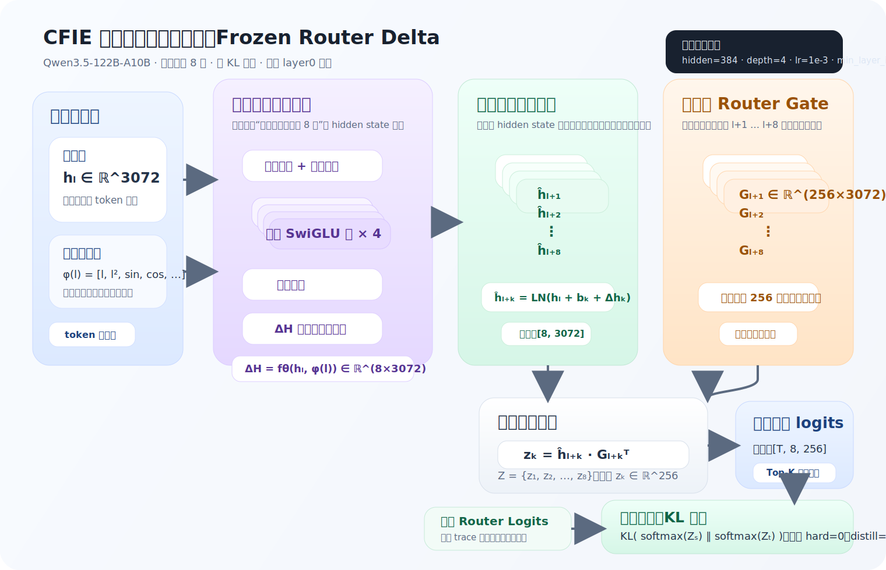

# CFIE

CFIE（Capacity-First Inference Engine）是一个面向桌面客户端的大模型本地推理与训练基础设施项目。
项目当前以 `vllm` 本地源码快照为基础，核心目标是在显存不足时，以 GPU + CPU 内存 + NVMe
构成分层容量兜底体系，支撑更大参数规模模型在本地完成推理、训练、自动化执行与后续应用承载。

## 项目立项目的

CFIE 的目标不是再做一个“能跑起来”的命令行 demo，而是建设一个面向终端用户客户端的平台底座：
在本地硬件资源受限的条件下，把 GPU、CPU 内存、NVMe 组织成统一容量体系，支撑大模型推理、
训练、回放与自动化能力，并向上承载可交互的 GUI 桌面个人助手。

当前重点包括：

- 客户端本地训推平台底座
  - 为 Windows / Linux 双平台客户端提供统一的模型加载、调度、训练、评估与部署运行时。
- 基于内存兜底的大模型运行
  - 在显存无法容纳全模型时，利用 CPU 内存和 NVMe 作为容量兜底，维持更大模型的本地执行能力。
- 面向 MoE 的执行优化与 predictor 路线
  - 面向大规模 MoE 模型，单卡显存通常无法让所有 experts 长期常驻，因此运行时必须在 GPU、CPU 内存、
    NVMe 之间做分层驻留与按需上载。CFIE 一方面持续优化 routed experts 的权重卸载、批量上载、并行执行
    与缓存命中策略；另一方面引入 predictor，利用前面层的 hidden state 提前预测后续层最可能命中的候选专家，
    从而在当前层计算尚未结束时，就提前把下一批 experts 预取到 GPU 或 staging 区，尽量把“专家上传时间”
    overlap 到正常推理计算中，降低冷启动停顿、减少整层突发上载，并提升大模型在本地设备上的实际吞吐与响应性。
- 用户自训练与自动化推理
  - 让用户可以基于自己的数据、任务轨迹与工作流进行自训练，并在本地执行自动化推理。
- 面向 GUI 桌面助手的上层能力预留
  - 后续计划提供应用层采集器，辅助采集鼠标、键盘等操作，完成训练数据构造、推理回放与自训练闭环，
    逐步落地为基于 GUI 的桌面个人助手平台。

当前仓库主要解决两类问题：

- 推理侧：复用真实推理引擎执行模型加载、调度、KV 规划、MoE 路由、量化推理与权重卸载。
- 训练侧：提供 `predictor-trace / predictor-train / predictor-eval`
  三段式流程，用真实前向采集 hidden state 与 router 标签，再训练 predictor 并评估 checkpoint。

项目当前更偏向“工程验证 + 主链落地”，README 重点说明：

1. 这个项目是什么。
2. 当前目录结构和主入口在哪里。
3. 应该如何构建与验证。
4. 当前已经跑通的 predictor 主方案与实验结论。

## 项目结构

仓库中最重要的目录如下：

- `cfie/`
  - 推理运行时主链。
  - 包含 CLI、引擎、worker、模型执行、量化、并行与服务相关代码。
- `cfie_training/`
  - 训练侧子项目。
  - 包含训练配置、数据规划、predictor 采集 / 训练 / 评估 CLI。
- `csrc/`
  - 原生扩展与 CUDA / C++ 实现。
- `tests/`
  - 单测与集成测试。
- `docs/`
  - 项目工作文档、注释规范、Smoke 测试记录与历史归档。
- `third_party/`
  - 第三方依赖源码快照，例如 `cutlass`、`vllm-flash-attn`。

## 当前能力概览

### 推理侧

- 支持 `chat` / `native-generate` / `serve` / `run-local` 等命令行入口。
- 支持量化模型加载，当前工程内重点验证过 GPTQ Marlin 路线。
- 支持 MoE 相关执行路径、CPU/NVMe 卸载与资源预算控制。
- 推理侧尽量复用真实引擎链路，而不是额外维护一套“简化版执行器”。

### 训练侧

- 支持基于真实模型前向的 predictor 训练数据采集。
- 支持从真实 hidden state 与 routed experts 构造教师轨迹。
- 支持 predictor checkpoint 训练与评估。
- 当前已验证 `Qwen3.5-122B-A10B` 档位最小 Smoke 流程可跑通。

## 环境要求

### 基础要求

- Python：`>=3.10,<3.14`
- PyTorch：CUDA 版本 `torch==2.10.0`
- CMake：`>=3.26.1`
- Ninja
- CUDA Toolkit（需要可用的 `nvcc`）

### Windows 额外要求

- Visual Studio 2022 Build Tools
- 建议已正确安装 CUDA Toolkit，并设置好 `CUDA_HOME` 或 `CUDA_PATH`

### Linux 额外要求

- GCC / G++ 或 Clang 等可用本地编译工具链

## 构建命令

下面给出推荐构建方式。项目会通过 `setup.py + CMake` 自动编译原生扩展。
由于 CFIE 需要复用你当前虚拟环境中已经安装好的 CUDA 版 PyTorch，
推荐使用 `--no-build-isolation`，避免 `pip` 在临时构建环境里拉起 CPU 版 `torch`
并导致原生扩展误判为“无 CUDA”。

### 1. 创建虚拟环境

Windows：

```powershell
cd C:\Users\13642\PycharmProjects\vllm\CFIE
py -3.12 -m venv .venv
.\.venv\Scripts\Activate.ps1
```

Linux：

```bash
cd /path/to/CFIE
python3.12 -m venv .venv
source .venv/bin/activate
```

### 2. 安装构建依赖

```bash
python -m pip install --upgrade pip setuptools wheel
python -m pip install cmake ninja packaging jinja2
```

先安装项目约定版本的 GPU 版 `torch` 与匹配的 `torchvision`。当前项目的构建与运行依赖统一按
`torch==2.10.0`、`torchvision==0.25.0` 维护，推荐直接从 `cu126` 仓库安装：

```bash
python -m pip install "torch==2.10.0" "torchvision==0.25.0" --index-url https://download.pytorch.org/whl/cu126
```

说明：

- `cu126` 仓库当前同时提供 `torch==2.10.0` 与匹配的 `torchvision==0.25.0`。
- `cu124` 仓库当前不提供 `torch==2.10.0`，因此这里不再保留 `CUDA 12.4` 的安装示例。
- 如果你需要编译原生扩展，建议本机 `CUDA Toolkit` 也尽量与 `cu126` 对齐，避免本地 `nvcc` 与 PyTorch CUDA 运行时版本错配。
- 如果你的环境里已经装好了这组匹配版本，可以跳过这一步。

### 3. 编译并以开发模式安装

普通安装：

```bash
python -m pip install --no-build-isolation -e .
```

如果你想限制编译并发，可以先设置 `MAX_JOBS`，再执行安装命令。例如：

Windows：

```powershell
$env:MAX_JOBS = "8"
python -m pip -v install --no-build-isolation -e .
```

Linux：

```bash
export MAX_JOBS=8
python -m pip -v install --no-build-isolation -e .
```

如果你需要观察 CUDA/C++ 编译进度，通常只要给 `pip` 增加一个 `-v` 就够了：

```bash
python -m pip -v install --no-build-isolation -e .
```

如果你还需要更详细的输出，可以改成 `-vv`。

这一步会自动：

- 读取 `pyproject.toml`
- 调用 `setup.py`
- 进入 CMake 构建原生扩展
- 安装 `cfie` 与 `cfie_training` 两个 Python 包

说明：

- 若直接使用 `python -m pip install -e .`，`pip` 可能会在隔离构建环境中安装 CPU 版 `torch`，
  进而报错 “CFIE native build requires a CUDA-enabled PyTorch environment”。
- Windows 下若已安装 `ninja`，CFIE 会优先使用 `Ninja` 生成器，避免 Visual Studio 默认生成器
  对 CUDA VS toolset 的额外依赖。
- `MAX_JOBS` 会传给 `setup.py` 控制 `cmake --build -j` 的并发数；如果机器内存紧张、CUDA 编译容易卡死或想更方便观察进度，建议显式设置。

这里的 `注意: 包含文件:` / `Note: including file:` 是 CMake + Ninja + MSVC 生成依赖关系时的正常输出，
通常不是编译错误。真正需要关注的是 `error`、`fatal error`、`ninja: build stopped`、`subprocess-exited-with-error`
等行。

### 4. 最小验证命令

验证推理 CLI 是否已注册：

```bash
python -m cfie.cli.main --help
```

验证训练 CLI 是否已注册：

```bash
python -m cfie_training.cli.main --help
```

## 常用命令

### 推理侧命令

交互式聊天：

```bash
python -m cfie.cli.main chat --model <模型路径>
```

单次生成：

```bash
python -m cfie.cli.main native-generate --model <模型路径> --prompt "你好"
```

### 训练侧命令

构造 predictor 教师轨迹：

Linux/macOS：

```bash
python -m cfie_training.cli.main predictor-trace \
  --profile qwen35-122b-a10b \
  --steps 1 \
  --examples-per-step 1 \
  --samples 1 \
  --tokens-per-sample 8 \
  --dataset <数据集路径> \
  --output <trace.json> \
  --json
```

Windows PowerShell：

```powershell
python -m cfie_training.cli.main predictor-trace `
  --profile qwen35-122b-a10b `
  --steps 1 `
  --examples-per-step 1 `
  --samples 1 `
  --tokens-per-sample 8 `
  --dataset <数据集路径> `
  --output <trace.json> `
  --json
```

训练 predictor：

Linux/macOS：

```bash
python -m cfie_training.cli.main predictor-train \
  --profile qwen35-122b-a10b \
  --trace-input <trace.json> \
  --epochs 1 \
  --checkpoint-output <predictor.ckpt> \
  --json
```

Windows PowerShell：

```powershell
python -m cfie_training.cli.main predictor-train `
  --profile qwen35-122b-a10b `
  --trace-input <trace.json> `
  --epochs 1 `
  --checkpoint-output <predictor.ckpt> `
  --json
```

评估 predictor：

Linux/macOS：

```bash
python -m cfie_training.cli.main predictor-eval \
  --profile qwen35-122b-a10b \
  --checkpoint <predictor.ckpt> \
  --trace-input <trace.json> \
  --json
```

Windows PowerShell：

```powershell
python -m cfie_training.cli.main predictor-eval `
  --profile qwen35-122b-a10b `
  --checkpoint <predictor.ckpt> `
  --trace-input <trace.json> `
  --json
```

### predictor 模型实验结论

下面汇总当前 `Qwen3.5-122B-A10B` predictor 实验中已经完成、且可复现的主方案。

- 统一实验底座：`Qwen3.5-122B-A10B`、`window_layers=8`、`stride_layers=4`、teacher trace 含未来窗口各层 router logits。
- 指标口径：`recall@8/16/24/32`，其中 `recall@16` 表示允许一倍候选冗余时的命中率。
- 当前最佳 loss 组合：纯 KL 蒸馏，即 `hard_target_loss_weight=0.0`、`router_distill_loss_weight=1.0`。
- 正式对比中屏蔽 `layer0` 样本，因为该层 hidden state 尚未经过任何 Transformer block，上下文信息不足，会显著压低上限。

当前最佳方案是 `frozen_router_delta`：保留一个小型可训练 predictor，只学习“从插入层 hidden state 到未来若干层 hidden state 的增量”，而未来层的 router gate 权重直接复用主模型 checkpoint 中的冻结参数。



该结构的关键点是：`router gate` 不再由 predictor 从零学习，而是把主模型已经学好的 gate 权重当作冻结先验，只让 predictor 学“未来 hidden state 如何演化”。这比直接训练一个独立分类头更贴近真实 MoE 路由几何。

| 方案 | 可训练部分 | 冻结主模型 gate | 屏蔽 `layer0` | Loss | 训练设置 | `r@8` | `r@16` | `r@24` | `r@32` | 说明 |
| --- | --- | --- | --- | --- | --- | --- | --- | --- | --- | --- |
| `factorized` | `hidden=640, depth=4`，约 `26.26M` 参数 | 否 | 否 | 纯 KL | `epoch=200, lr=1e-3` | `0.6137` | `0.7862` | `0.8524` | `0.8878` | 纯 predictor 基线 |
| `factorized` | `hidden=640, depth=4`，约 `26.26M` 参数 | 否 | 是 | 纯 KL | `epoch=200, lr=1e-3` | `0.6432` | `0.8216` | `0.8873` | `0.9213` | 仅屏蔽 `layer0` 就有明显提升 |
| `frozen_router_delta` | `hidden=384, depth=4`，约 `17.77M` 参数 | 是 | 是 | 纯 KL | `epoch=100, lr=1e-3` | `0.6793` | `0.8487` | `0.9004` | `0.9251` | 更小模型已超过 plain predictor |
| `frozen_router_delta` | `hidden=512, depth=4`，约 `26.82M` 参数 | 是 | 是 | 纯 KL | `epoch=100, lr=1e-3` | `0.6724` | `0.8423` | `0.8955` | `0.9213` | 单纯放大宽度没有继续提升 |
| `frozen_router_delta` | `hidden=384, depth=4`，约 `17.77M` 参数 | 是 | 是 | 纯 KL | `epoch=100, lr=3e-3` | `0.6643` | `0.8358` | `0.8907` | `0.9176` | 学习率过高，收敛反而变差 |
| `frozen_router_delta` | `hidden=384, depth=4`，约 `17.77M` 参数 | 是 | 是 | 纯 KL | `epoch=200, lr=1e-3` | `0.7213` | `0.8949` | `0.9424` | `0.9630` | 当前最佳方案 |

当前可以给出的工程结论如下：

- `layer0` 样本需要剔除；即便不改模型，仅做这一步，`factorized` 的 `r@16` 也从 `0.7862` 提升到 `0.8216`。
- 冻结主模型 router gate 明显有效；`frozen_router_delta` 用更少的可训练参数，就把 `r@16` 提升到了 `0.8949`。
- 单纯增大 predictor 宽度并不保证更好；`hidden=512` 在相同设置下反而略差于 `hidden=384`。
- 当前最佳口径下，继续训练到 `epoch=200` 仍然有效；`frozen_router_delta 384x4` 的 `r@16` 从 `epoch=100` 的 `0.8487` 继续升到 `0.8949`。

推荐作为默认训练配置的 predictor 方案：

- `model_architecture=frozen_router_delta`
- `hidden_dim=384`
- `model_depth=4`
- `learning_rate=1e-3`
- `hard_target_loss_weight=0.0`
- `router_distill_loss_weight=1.0`
- `min_layer_index=1`

## 当前验证情况

截至当前仓库状态，以下方向已经形成可复现工程链路：

- Windows 单卡下的最小推理主链可运行。
- `Qwen3.5-35B-A3B` 与 `Qwen3.5-122B-A10B` 路线已有验证基线。
- predictor 训练侧三段式 CLI 已打通：
  - `predictor-trace`
  - `predictor-train`
  - `predictor-eval`
- `Qwen3.5-122B-A10B` 的最小 predictor Smoke 记录见：
  - `docs/122B_predictor_CLI_smoke.md`

项目仍在持续构建中，README 当前只保留已经稳定落地、适合对外阅读的主链能力、实验结论与主要入口。

## 文档索引

- 文档导航：`docs/00_文档导航.md`
- 122B predictor Smoke：`docs/122B_predictor_CLI_smoke.md`
- 注释规范：`docs/代码注释工作文档.md`

## 说明

- 本项目当前以工程主链跑通为优先目标。
- 若你准备将其上传到 GitHub，建议先补充 `.gitignore`，避免把模型、缓存、编译产物、
  `.venv`、`.tmp`、日志和本地 IDE 文件直接提交。
