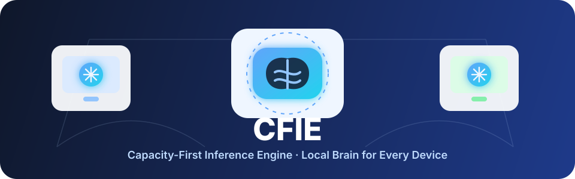
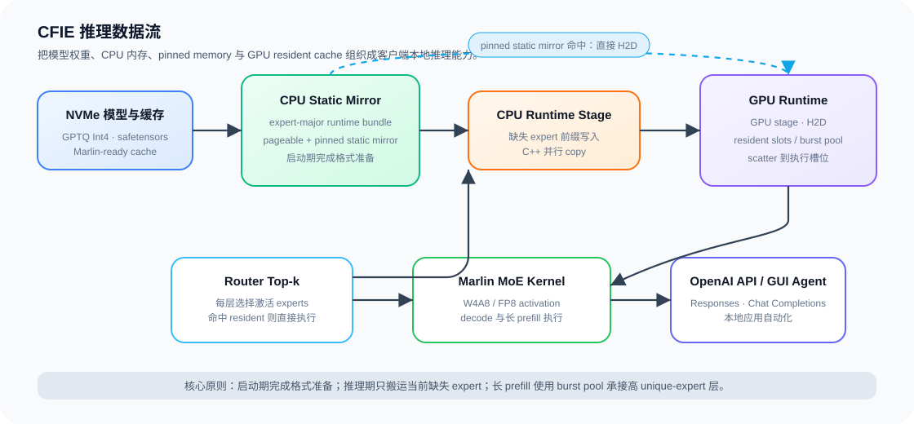
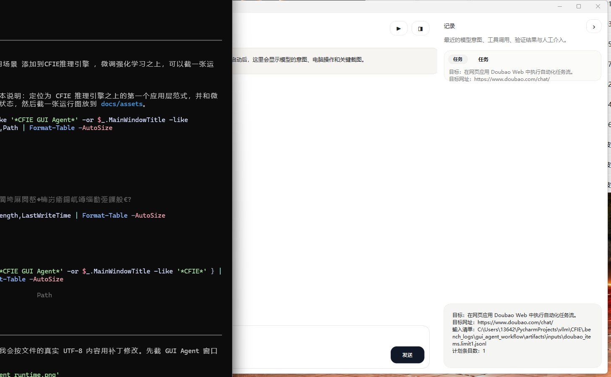
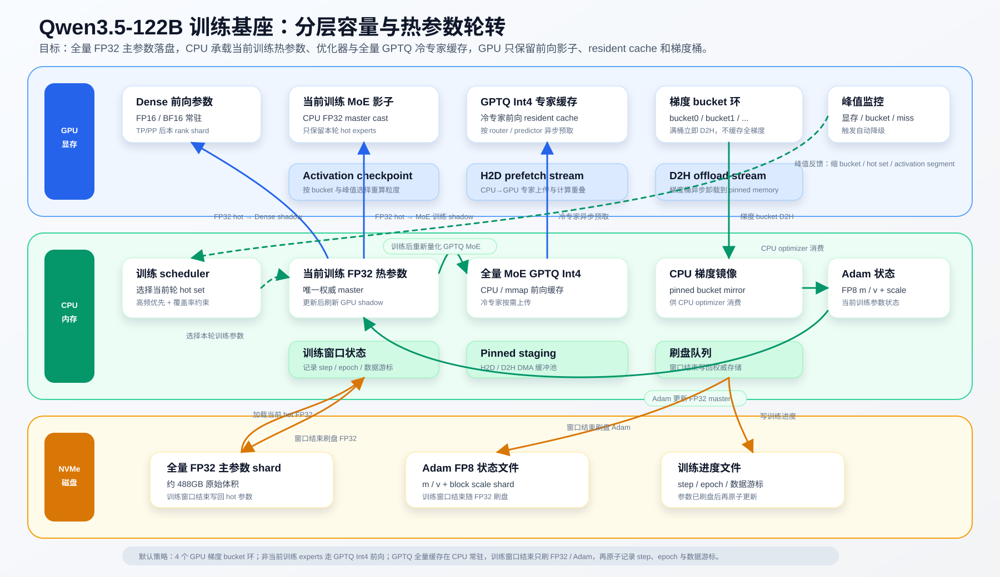

# CFIE



CFIE, Capacity-First Inference Engine, 是基于 vLLM 代码演进的客户端本地大模型推理项目。当前主线目标是：在单卡显存不足以完整常驻大模型 MoE experts 时，通过 CPU 内存、pinned memory、GPU resident slots 和 NVMe 模型缓存配合，让 Qwen3.5 GPTQ MoE 模型可以在本地 32GB 显卡上完成长上下文推理和 OpenAI 兼容服务。

CFIE 的定位是让智能设备拥有自己的本地推理大脑。未来的 GUI Agent、桌面助手、移动端自动化、个人数据分析和本地应用控制，不应该把所有感知、记忆和决策都交给远端共享推理集群。更合理的方向是：每个客户端设备都具备低延迟、可离线、可私有化、可持续适配用户习惯的独立大脑，上层应用通过标准 API 调用它完成自动化任务。

## 支持模型

当前重点支持 Qwen3.5 MoE GPTQ Int4 量化模型：

| 模型 | Hugging Face |
| --- | --- |
| Qwen3.5-122B-A10B-GPTQ-Int4 | [Qwen/Qwen3.5-122B-A10B-GPTQ-Int4](https://huggingface.co/Qwen/Qwen3.5-122B-A10B-GPTQ-Int4) |
| Qwen3.5-35B-A3B-GPTQ-Int4 | [Qwen/Qwen3.5-35B-A3B-GPTQ-Int4](https://huggingface.co/Qwen/Qwen3.5-35B-A3B-GPTQ-Int4) |

推荐把模型文件和 CFIE 生成的 Marlin-ready cache 放在高速 NVMe 盘上。当前测试机器使用 D 盘 PCIe 5 高速盘承载模型和 cache。

## 推理架构

CFIE 使用 MoE tiered cache，把模型权重、CPU 内存、pinned memory 和 GPU resident slots 组织成可运行的本地推理能力。



核心机制：

- CPU static mirror：启动期把 MoE expert 转成运行时可直接使用的 Marlin-ready expert-major bundle。
- CPU pinned static mirror：按预算把部分 expert 放入 pinned memory，减少 H2D 前的中转成本。
- GPU resident slots：每层只常驻有限数量的高频 expert，例如 `--gpu-slots-per-layer 16`。
- Runtime stage：推理期只处理当前缺失 expert，写入可复用 CPU/GPU stage 后再 scatter 到目标 GPU slot。
- Prefill burst pool：长 prefill 中某层触发 expert 数超过 resident slots 时，用临时 burst pool 承接执行。
- W4A8 / FP8 activation：GPTQ Marlin 路径支持 `--marlin-input-dtype fp8`，当前推荐默认使用。

## GUI Agent 应用场景

GUI Agent 是 CFIE 之上的第一个应用层范式，用来验证本地大模型推理、视觉理解、computer-use 工具执行和人工接管闭环能否在真实桌面任务中稳定工作。它不是单独的测试脚本，而是面向浏览器、桌面软件、后台运营、移动设备控制和后续游戏低延迟场景的通用自动化客户端。

项目分层如下：

```text
cfie_gui_agent
  -> 桌面客户端、任务描述、截图/视频上下文、人工接管、轨迹记录

cfie_client
  -> computer-use 工具协议、Windows 鼠标键盘执行、截图与坐标映射

CFIE 推理引擎
  -> Qwen3.5 122B/35B 本地 OpenAI Responses / Chat / VL 服务

cfie_training
  -> 轨迹数据回流、SFT、奖励建模、强化学习与评估闭环
```

在 GUI Agent 场景中，用户为每个目标 APP 配置任务规则、界面说明和图片/视频引用；模型通过 Responses API 观察当前界面并输出工具调用；`cfie_client` 负责执行受控的鼠标、键盘、截图和文件读写动作；`cfie_gui_agent` 记录每一步输入、模型意图、工具调用、截图证据、人工接管和任务结果。后续这些轨迹可以转成监督微调样本、偏好样本或带 reward 的强化学习数据，用于持续改进本地 Agent。

运行时示例：



## 实测环境

以下配置是本文档中推荐参数和测速结果的来源，其他机器需要重新验证：

| 硬件 | 配置 |
| --- | --- |
| GPU | NVIDIA GeForce RTX 5090 32GB，driver 591.86 |
| 内存 | 160 GiB installed，约 157.5 GiB usable，3600 MT/s |
| 存储 | D 盘 PCIe 5 高速 NVMe，用于模型文件和 CFIE cache |
| 测试模型 | Qwen3.5-122B-A10B-GPTQ-Int4 |

本地模型路径示例：

```text
D:\models\Qwen3.5-122B-A10B-GPTQ-Int4\snapshots\5b9f0050d3ec98b0c81a7716776533c5eacebb64
```

## 实测速度

以下数据来自当前 Windows + RTX 5090 32GB + Qwen3.5-122B-A10B-GPTQ-Int4 的本地测试，配置为 `gpu_slots_per_layer=16`、`prefill_burst_slots=256`、`prepare_cpu_copy_threads=32`、`cpu_static_pinned_gb=40-44`、`marlin_input_dtype=fp8`、关闭 CUDA graph。

| 场景 | 结果 |
| --- | ---: |
| 512 token decode steady TPS | 约 `7.3-7.7 tok/s` |
| 512 token decode tail 64 TPS | 最高约 `8.2 tok/s` |
| 首 token 延迟 | 约 `1.8-2.0 s` |
| OpenAI/VL，约 2096 input tokens 文本请求 | `5.4 s` |
| OpenAI/VL，1920x1080 单图请求，约 2061 input tokens | `6.0 s` |

当前 Windows 环境下 pinned static mirror 主要覆盖前 37 层，后 11 层仍需要 pageable CPU memory 到 pinned runtime stage 的中转，prepare 端主要瓶颈在这部分 CPU pack。若部署在能够让 MoE static mirror 全量进入 pinned memory 的环境中，例如更充足内存和更高 pinned 上限的原生 Linux，按当前逐层 prepare 耗时估算，decode 速度有机会提升到约 `11 tok/s`。该数值是基于瓶颈拆分的工程估算，不是当前 Windows 配置的实测值。

## 安装

以下命令以 Windows PowerShell 为例。

创建虚拟环境：

```powershell
py -3.12 -m venv ..\.venv
..\.venv\Scripts\python.exe -m pip install -U pip setuptools wheel
```

安装构建依赖：

```powershell
..\.venv\Scripts\python.exe -m pip install cmake ninja packaging jinja2
```

安装 CUDA 版 PyTorch。必须是 CUDA wheel，不能是 CPU wheel；本项目 `pyproject.toml` 约束 `torch==2.10.0`：

```powershell
..\.venv\Scripts\python.exe -m pip install torch==2.10.0 torchvision --index-url <your-torch-cuda-wheel-index>
```

安装 CFIE：

```powershell
$env:MAX_JOBS = "8"
..\.venv\Scripts\python.exe -m pip install --no-build-isolation -e .
```

检查 CLI：

```powershell
..\.venv\Scripts\python.exe -m cfie.cli.main --help
..\.venv\Scripts\python.exe -m cfie.entrypoints.openai.api_server --help
```

安装注意事项：

- 使用 `--no-build-isolation`，避免 pip 在隔离构建环境里误装 CPU 版 torch。
- Windows 需要 Visual Studio 2022 Build Tools、CUDA Toolkit、CMake、Ninja。
- Windows 和 WSL 应分别使用自己的 venv，不要混用 site-packages 或编译产物。

## 推荐 CLI 参数

128K GUI Agent / 长上下文推荐基线：

```text
--max-model-len 128000
--max-num-seqs 1
--max-num-batched-tokens 6288
--kv-cache-memory-bytes 4000000000
--gpu-slots-per-layer 16
--prefill-burst-slots 256
--prepare-cpu-copy-threads 32
--cpu-static-pinned-gb 40
--enable-prefix-caching
--marlin-input-dtype fp8
--reasoning-parser qwen3
--default-chat-template-kwargs '{"enable_thinking":false}'
--enforce-eager
```

参数含义：

| 参数 | 推荐值 | 说明 |
| --- | ---: | --- |
| `--max-model-len` | `128000` | 当前实测更稳的长上下文档位。 |
| `--max-num-seqs` | `1` | GUI Agent 单会话优先，避免为多并发序列放大 KV 预算。 |
| `--max-num-batched-tokens` | `6288` | GUI Agent 交互式默认档位，约为低延迟 2096 档的 3 倍；在当前显存盈余较大的配置下，减少多图/长文本单轮输入被切分的概率。 |
| `--kv-cache-memory-bytes` | `4000000000` | 手动预留约 3.73 GiB KV，适配 128K 上下文。 |
| `--gpu-slots-per-layer` | `16` | 每层 GPU resident expert slots。 |
| `--prefill-burst-slots` | `256` | 长 prefill 的临时 expert 执行池。 |
| `--prepare-cpu-copy-threads` | `32` | CPU static mirror 到 runtime stage 的并行 copy 线程数。 |
| `--cpu-static-pinned-gb` | `40` | OpenAI / VL 服务推荐值，给 runtime stage 留 pinned headroom。 |
| `--enable-prefix-caching` | 开启 | GUI Agent 场景必须显式开启。 |
| `--marlin-input-dtype` | `fp8` | 当前推荐 W4A8 路径。 |
| `--reasoning-parser` | `qwen3` | Qwen3/Qwen3.5 的 `<think>...</think>` 解析器；开启思考模式时必须配置。 |
| `--enforce-eager` | 开启 | 当前默认不启用 CUDA graph。 |

长文档批处理可以单独测试 `--max-num-batched-tokens 8192` 或更高档位；GUI Agent 的默认目标是让每轮新增截图和文本尽量落在 `6288` token 内，复用 prefix cache 中的历史上下文。

### 思考模式

服务启动命令仍推荐用 `--default-chat-template-kwargs '{"enable_thinking":false}'` 作为全局低延迟默认值，并同时配置 `--reasoning-parser qwen3`。这样普通请求默认不思考；需要思考的 GUI Agent 请求可以显式打开 reasoning，并由服务端把 Qwen 的 `<think>...</think>` 解析为 Responses 标准 `type="reasoning"` 输出项。

当前 GUI Agent 自动化任务的默认候选配置是：

```text
reasoning_mode = guided
reasoning_effort = medium
max_output_tokens = 1024
max_visual_frames = 24
screenshot_size = 900
```

在 2026-05-29 的 Doubao Web 自动化验证中，`guided + medium` 连续 6 轮、18/18 题正确，平均模型响应约 `27.4 s`，优于关闭思考、默认 Qwen thinking 和 `low guided`。实验记录见 `docs/experiments/2026-05-29_gui_agent_reasoning_sweep.md`。

如果请求开启 reasoning，服务端必须配置对应模型的 reasoning parser。

## 启动 OpenAI 服务

### 文本服务

```powershell
..\.venv\Scripts\python.exe -m cfie.entrypoints.openai.api_server `
  --model D:\models\Qwen3.5-122B-A10B-GPTQ-Int4\snapshots\5b9f0050d3ec98b0c81a7716776533c5eacebb64 `
  --served-model-name qwen35 `
  --host 127.0.0.1 `
  --port 8000 `
  --max-model-len 128000 `
  --max-num-seqs 1 `
  --max-num-batched-tokens 6288 `
  --kv-cache-memory-bytes 4000000000 `
  --gpu-slots-per-layer 16 `
  --prefill-burst-slots 256 `
  --prepare-cpu-copy-threads 32 `
  --cpu-static-pinned-gb 40 `
  --enable-prefix-caching `
  --language-model-only `
  --skip-mm-profiling `
  --marlin-input-dtype fp8 `
  --reasoning-parser qwen3 `
  --default-chat-template-kwargs '{"enable_thinking":false}' `
  --enforce-eager
```

### VL / GUI Agent 服务

```powershell
..\.venv\Scripts\python.exe -m cfie.entrypoints.openai.api_server `
  --model D:\models\Qwen3.5-122B-A10B-GPTQ-Int4\snapshots\5b9f0050d3ec98b0c81a7716776533c5eacebb64 `
  --served-model-name qwen35 qwen35-vl `
  --host 127.0.0.1 `
  --port 8000 `
  --max-model-len 128000 `
  --max-num-seqs 1 `
  --max-num-batched-tokens 6288 `
  --kv-cache-memory-bytes 4000000000 `
  --gpu-slots-per-layer 16 `
  --prefill-burst-slots 256 `
  --prepare-cpu-copy-threads 32 `
  --cpu-static-pinned-gb 40 `
  --enable-prefix-caching `
  --marlin-input-dtype fp8 `
  --reasoning-parser qwen3 `
  --default-chat-template-kwargs '{"enable_thinking":false}' `
  --limit-mm-per-prompt '{"image":40,"video":0}' `
  --enforce-eager
```

## API 示例

Responses 文本请求：

```powershell
curl http://127.0.0.1:8000/v1/responses `
  -H "Content-Type: application/json" `
  -d '{
    "model": "qwen35",
    "input": "用一句话介绍 CFIE。"
  }'
```

## 微调与强化学习设计稿

`cfie_training/` 是后续训练、微调、强化学习和 GUI Agent 闭环数据工作的开发区域。当前训练模块仍在开发中，README 暂不承诺稳定训练 API；设计目标是把本地推理、GUI Agent 轨迹回流、参数分层、训练调度、奖励评估和自动化验证逐步接入同一套客户端智能体基础设施。


