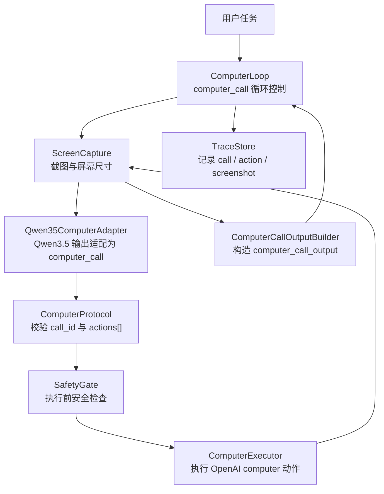
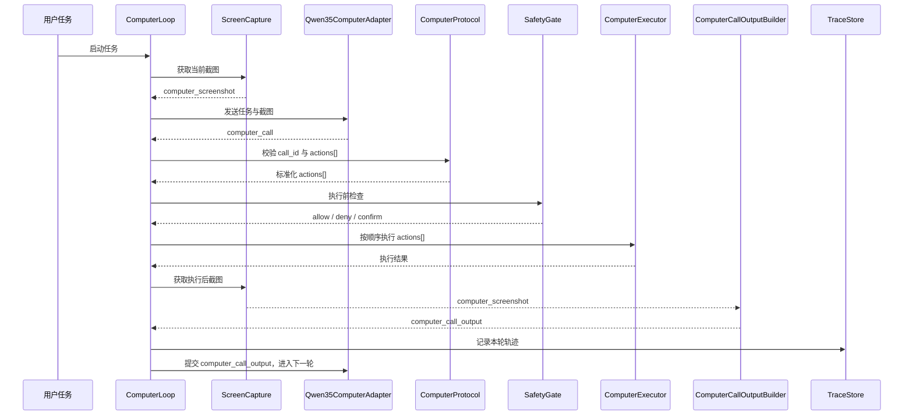

# cfie_client 架构与实现说明

`cfie_client` 是 CFIE 的客户端自动化应用层。初版设计目标是尽量直接对齐 OpenAI `computer` 工具协议，让 Qwen3.5 视频理解模型输出同构的 UI 动作，再由本地客户端执行鼠标、键盘、滚轮、等待与截图回传。

核心原则：`cfie_client` 不发明新的主协议。它只实现一套本地 `computer` harness，负责执行模型返回的 `computer_call.actions[]`，并把执行后的截图封装成 `computer_call_output` 回传给下一轮决策。

## 协议闭环

```text
模型请求
  -> computer_call { call_id, actions[] }
本地客户端
  -> 按顺序执行 actions[]
本地客户端
  -> 截图
模型输入
  -> computer_call_output { call_id, computer_screenshot }
```

## 总体架构



## 核心对象

### computer_call

`computer_call` 表示模型请求客户端执行一批 UI 动作。

```json
{
  "type": "computer_call",
  "call_id": "call_001",
  "actions": [
    { "type": "screenshot" },
    { "type": "click", "x": 640, "y": 420, "button": "left" }
  ],
  "status": "completed"
}
```

`cfie_client` 只消费 `actions[]`，并且必须按数组顺序执行。

### computer_call_output

`computer_call_output` 表示客户端完成动作后回传给模型的新观察。

```json
{
  "type": "computer_call_output",
  "call_id": "call_001",
  "output": {
    "type": "computer_screenshot",
    "image_url": "data:image/png;base64,...",
    "detail": "original"
  }
}
```

`call_id` 必须和上一轮 `computer_call.call_id` 对齐。

## 动作集合

核心层只接受 OpenAI `computer` 动作集合：

```text
click
double_click
scroll
type
wait
keypress
drag
move
screenshot
```

初版不把 `hotkey`、`clipboard_set`、`window_focus`、`app_launch` 做进核心协议。若后续需要这些能力，应放在外层 adapter 或普通自定义工具里，避免破坏 `computer` 协议兼容性。

## 分层职责

### 1. ComputerLoop

`ComputerLoop` 管理一轮又一轮的 `computer_call`。

它负责：

- 接收用户任务。
- 请求 Qwen3.5 视觉模型产生下一轮 `computer_call`。
- 判断模型是否还在返回 `computer_call`。
- 在每轮动作执行后提交 `computer_call_output`。
- 在模型不再返回 `computer_call` 时结束任务。

### 2. Qwen35ComputerAdapter

`Qwen35ComputerAdapter` 负责把 Qwen3.5 的视觉理解结果约束到 OpenAI `computer_call` 形态。

它不执行动作，只保证输出结构符合：

```text
type = computer_call
call_id = 本轮唯一调用 ID
actions = OpenAI computer actions[]
status = completed
```

### 3. ComputerProtocol

`ComputerProtocol` 是协议校验层。

它负责：

- 校验 `computer_call.type`。
- 校验 `call_id` 是否存在。
- 校验 `actions[]` 是否为列表。
- 校验每个 action 的字段是否符合动作类型。
- 拒绝未知 action type。

### 4. SafetyGate

`SafetyGate` 在真实执行前做最小安全检查。

初版至少检查：

- 坐标是否落在屏幕范围内。
- `button` 是否为允许值。
- `scroll` 位移是否超过单次限制。
- `type` 文本是否触发敏感输入策略。
- `keypress` 是否属于允许按键集合。
- 是否需要人工确认。

### 5. ComputerExecutor

`ComputerExecutor` 是本地动作执行器。

它把协议动作映射到真实客户端操作：

```text
click        -> 鼠标单击
double_click -> 鼠标双击
scroll       -> 鼠标滚轮或触控板滑动
type         -> 文本输入
wait         -> 等待 UI 更新
keypress     -> 单个按键或组合按键
drag         -> 鼠标拖拽路径
move         -> 鼠标移动
screenshot   -> 请求截图
```

执行器只理解动作协议，不理解任务语义。

### 6. ScreenCapture

`ScreenCapture` 负责生成 OpenAI 协议需要的截图。

初版输出：

```text
computer_screenshot
image_url = data:image/png;base64,...
detail = original
```

同时它应保存本地元信息：

- 屏幕宽高。
- 截图时间。
- 前台窗口标题。
- 鼠标位置。

这些元信息可进入 `TraceStore`，但不应改变核心 `computer_call_output` 结构。

### 7. TraceStore

`TraceStore` 记录完整自动化轨迹。

建议记录：

- 用户任务。
- 每轮 `computer_call`。
- 每个 action 的执行结果。
- 每轮 `computer_call_output`。
- 截图文件或 base64 摘要。
- SafetyGate 判定。
- 错误与中断原因。

## 单轮时序



## 当前目录

```text
cfie_client/
  __init__.py
  adapter.py              # Qwen3.5 输出到 computer_call 的轻量适配
  loop.py                 # 执行 computer_call 并构造 computer_call_output
  protocol.py             # OpenAI computer 协议对象、校验与序列化
  safety.py               # 执行动作前的本地安全边界检查
  screen.py               # 屏幕截图并封装 data:image/png;base64
  trace.py                # JSONL 调试轨迹记录
  executor/
    __init__.py
    computer.py           # 平台无关执行分发器与 backend 协议
    keyboard.py           # Windows 键盘输入实现
    mouse.py              # Windows 鼠标点击、移动、拖拽实现
    scroll.py             # Windows 滚轮实现
    wait.py               # 等待动作实现
    windows.py            # Windows backend 汇总
```

## 不进入核心协议的能力

以下能力初版不放进 `computer` 核心协议：

- 启动应用。
- 聚焦窗口。
- 操作剪贴板。
- DOM 查询。
- 文件系统读写。
- 长脚本执行。

这些能力如果需要，应通过外部普通工具或 harness adapter 提供。`cfie_client` 的核心协议层保持和 OpenAI `computer` 动作集合一致。

## OpenTelemetry GenAI 轨迹

`TraceStore` 使用 OpenTelemetry GenAI 风格记录 computer 工具调用轨迹。

computer 动作在轨迹里按 `execute_tool` 操作记录：

```json
{
  "name": "execute_tool computer",
  "attributes": {
    "gen_ai.operation.name": "execute_tool",
    "gen_ai.tool.name": "computer",
    "gen_ai.tool.type": "function",
    "gen_ai.tool.call.id": "call_001",
    "gen_ai.tool.call.arguments": "{...}"
  },
  "body": {
    "type": "computer_call",
    "call_id": "call_001"
  }
}
```

执行结果使用同一组 tool call 属性，并把结果写入：

```text
gen_ai.tool.call.result
```

截图不会直接以内联 base64 塞进 JSONL；`TraceStore` 会把 `data:image/...;base64,...` 落盘成 artifact，并在事件里记录 `path`、`sha256`、`bytes` 与 `mime_type`。

AI 应用自动化测试、benchmark、judge、评分口径等业务能力不放在 `cfie_client`，应由上层包组合使用这套通用轨迹。

## 实现顺序

1. 定义 `protocol.py`，先把 `computer_call`、九类 action、`computer_call_output` 固定下来。
2. 实现 `screen.py`，保证能输出 `computer_screenshot`。
3. 实现 `executor/computer.py`，逐个接入九类动作。
4. 实现 `loop.py`，跑通 `computer_call -> execute -> screenshot -> computer_call_output`。
5. 接入 `Qwen35ComputerAdapter`，让 Qwen3.5 输出严格落到同一协议。
6. 加入 `SafetyGate` 与 `TraceStore`，形成可审计闭环。
