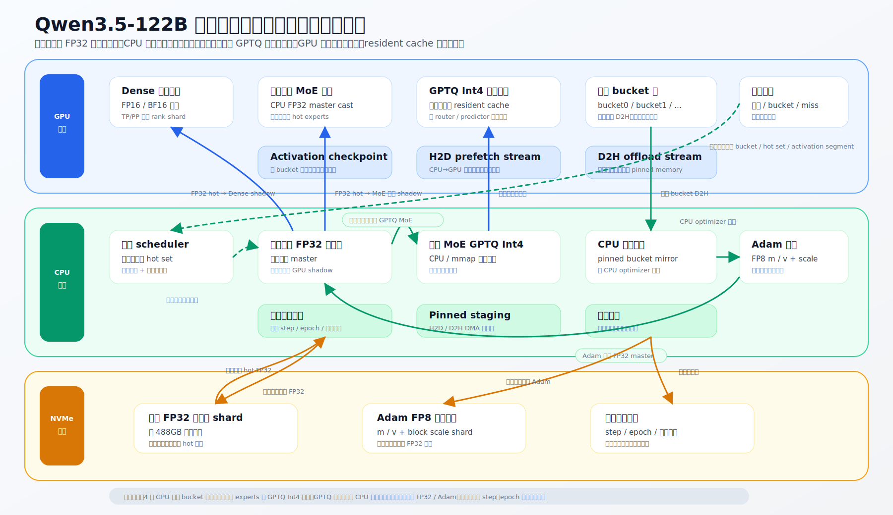

# Qwen3.5-122B 训练基座详细设计

## 1. 目标

本文定义 Qwen3.5-122B-A10B 档位的训练基座。该基座的核心目标不是把 122B 全量参数同时放入 GPU 训练，而是通过”磁盘 FP32 主参数与优化器状态 + CPU 热参数/优化器/全量 GPTQ Int4 冷专家缓存 + GPU 前向影子参数与 resident cache”的分层体系，在有限显存下完成可恢复、可观测、可逐轮覆盖全模型的训练。

CPU 内存承担全量冷专家缓存角色：所有非当前训练的 routed experts 以 GPTQ Int4 格式常驻 CPU 内存，冷热切换时从 CPU 缓存按需加载/写回，无需访问 NVMe。NVMe 仅存储 FP32 权威主参数、Adam 优化器状态和训练进度文件。

设计默认面向单节点单卡或多卡的“单 rank 局部视角”。多 GPU 场景下，每个 rank 使用相同的内存管理协议，只是参数切片、专家切片和通信域不同。

## 2. 基本约束

- 模型 profile：`qwen35-122b-a10b`。
- MoE 结构：routed experts 采用 top-k 路由，当前已知目标路径为 top-8 激活。
- 权重量化：非当前训练的 MoE experts 使用 GPTQ Int4 前向参数。
- 热训练参数：当前轮次被 scheduler 选中的 dense / MoE 参数以 FP32 主参数形式放在 CPU，GPU 只保留 FP16/BF16 前向影子。
- 冷参数：当前不训练的 MoE 参数只提供前向能力，默认不产生 weight grad。
- 梯度：GPU 使用固定大小的梯度 bucket 环，不要求一次容纳全部训练参数梯度。
- 优化器：当前训练参数的 Adam 状态放在 CPU，状态使用 FP8 + scale 压缩。
- 持久化：训练窗口与 hot set round 严格对齐——每次 hot set 切换即窗口结束。窗口结束时先把当前 hot set 的 FP32 主参数和 Adam 状态写回 NVMe 权威存储，再将退出的 hot 专家重新量化为 GPTQ Int4 写回 CPU 缓存，最后原子记录 `step / epoch / 数据游标` 并加载下一 hot set。

## 3. 总体架构



## 4. 参数分层

### 4.1 参数类型

| 类型 | GPU 表示 | CPU 表示 | 磁盘表示 | 是否训练 | 说明 |
|---|---:|---:|---:|---|---|
| dense forward 参数 | FP16/BF16 | 可选 FP32 hot master | FP32 shard | 可配置 | dense 参数常驻 GPU 前向路径，是否训练由策略决定 |
| 当前训练 MoE 参数 | FP16/BF16 shadow | FP32 hot master | FP32 shard | 是 | 当前轮次被 scheduler 选中的 experts 或子模块 |
| 非当前训练 MoE 参数 | GPTQ Int4 resident cache | GPTQ Int4 全量冷专家缓存（CPU 权威副本） | 不单独持久化（仅 checkpoint export 时导出） | 否 | CPU 内存持有全部冷专家 GPTQ Int4 权重，GPU 仅缓存当前 predict 命中的子集 |
| 梯度 | bucket 内 FP16/BF16/FP32 | bucket 镜像 | 不持久化 | 临时 | bucket 满后立即异步卸载 |
| Adam 状态 | 不常驻 | FP8 m/v + scale | FP8 m/v + scale shard | 是 | 只加载当前训练热参数对应状态 |

### 4.2 参数生命周期

```text
磁盘 FP32 shard
  -> scheduler 选中本轮 hot set
  -> CPU 读取 FP32 hot master
  -> 加载 / 初始化 Adam FP8 状态
  -> CPU cast 或 GPU cast 生成 FP16/BF16 forward shadow
  -> forward / activation checkpoint recompute / backward
  -> GPU grad bucket 满后 D2H
  -> CPU Adam 更新 FP32 hot master
  -> 刷新 GPU shadow
  -> 训练窗口结束写回 FP32 shard、Adam 状态和 GPTQ cache
  -> 原子更新训练进度文件
```

冷 MoE 参数的生命周期独立：

```text
磁盘 FP32 shard
  -> 启动时批量量化生成 GPTQ Int4 cache，加载到 CPU 内存（全量常驻）
  -> CPU GPTQ Int4 全量缓存作为冷专家权威运行时副本
  -> predictor 预测 / router 实际激活触发专家 H2D prefetch
  -> GPU resident expert cache 命中后执行 GPTQ Int4 前向
  -> GPU cache 按 next-use distance 淘汰（淘汰时不写回，CPU 缓存已持有）
  -> 训练窗口结束时，本窗口训练过的 hot 专家重新量化为 GPTQ Int4，原地更新 CPU 缓存
  -> 仅在 checkpoint 完整导出时，CPU GPTQ 缓存才序列化到 NVMe
```

## 5. 显存规划

### 5.1 规划原则

显存按“硬上限 + 弹性池”管理。任何自动调参都不能突破硬上限。

```text
vram_usable = total_vram - driver_reserve - emergency_reserve
vram_used =
    dense_forward_bytes
  + hot_shadow_bytes
  + gptq_expert_cache_bytes
  + grad_ring_bytes
  + activation_workspace_bytes
  + kernel_workspace_bytes
  + communication_bytes
```

硬约束：

- `torch.cuda.max_memory_reserved()` 必须低于 `total_vram * 0.88`。
- 运行期 emergency reserve 不低于 `max(1.5GiB, total_vram * 0.06)`。
- 任意阶段发现连续 3 次 step 峰值超过预算 95%，自动降低 hot set 或 activation checkpoint segment。
- 任意阶段发现 CUDA OOM，当前 microbatch 作废，释放缓存后按降级策略重试。

### 5.2 32GiB GPU 默认档

| 分区 | 默认预算 | 可调范围 | 说明 |
|---|---:|---:|---|
| dense FP16/BF16 forward shard | 10.0GiB | 8-14GiB | TP/PP 后的本 rank dense shard |
| 当前训练参数 GPU shadow | 4.0GiB | 2-6GiB | hot MoE experts 或 dense 子模块的 FP16/BF16 影子 |
| GPTQ Int4 expert resident cache | 3.0GiB | 1-6GiB | 按 `(layer, expert, shard)` 缓存冷专家 |
| activation / recompute workspace | 4.5GiB | 2-7GiB | activation checkpoint segment 内临时激活与重算缓冲 |
| GPU grad bucket ring | 2.0GiB | 1-4GiB | 默认 4 个 bucket，每个 512MiB |
| kernel / comm workspace | 2.0GiB | 1-3GiB | CUTLASS、Marlin、通信临时空间 |
| fragmentation / allocator reserve | 2.5GiB | 1.5-4GiB | 给 CUDA allocator 碎片和瞬时峰值 |
| driver / emergency headroom | 4.0GiB | 不建议减少 | 不纳入可分配池 |

如果 dense shard 超过 10GiB，需要优先启用 TP/PP 切分，而不是压缩梯度 bucket。梯度 bucket 太小会导致 D2H 频繁启动、CPU optimizer 无法形成吞吐。

### 5.3 48GiB / 80GiB GPU 扩展档

- 48GiB：优先把 GPTQ resident cache 提升到 6-8GiB，把 grad ring 提升到 4GiB。
- 80GiB：优先扩大 hot shadow，允许单轮训练更多 experts；其次扩大 activation workspace，减少 recompute。
- 不建议把全部额外显存都给 activation。当前架构的瓶颈更可能是 expert H2D miss 和 CPU optimizer 回写。

## 6. CPU 内存规划

### 6.1 CPU 分区

| 分区 | 默认策略 | 说明 |
|---|---|---|
| FP32 hot master | pageable + pinned staging | 当前轮次训练参数的 FP32 主副本 |
| Adam FP8 状态 | pageable，更新前 pin | `m` / `v` 使用 FP8 block quant，附带 scale |
| GPTQ Int4 全量冷专家缓存 | RAM 常驻（CPU 权威副本） | 全量 256 routed experts 的 Int4 前向权重，启动时从 FP32 量化生成并常驻 CPU |
| CPU grad bucket mirror | pinned | GPU D2H 的目标地址，供 CPU optimizer 消费 |
| H2D staging | pinned | FP16 shadow 和 GPTQ expert 的上传缓冲 |
| dataset / tokenizer | pageable | 与参数系统隔离 |

### 6.2 容量估算

设：

- `P_total`：全模型参数量。
- `P_moe`：MoE expert 参数量。
- `P_hot`：当前轮次训练参数量。
- `P_trainable_seen`：已经进入训练计划、需要持久化 optimizer 状态的参数量。

估算：

```text
fp32_hot_master      = P_hot * 4
adam_fp8_state_hot   = P_hot * (2 + scale_overhead)
adam_fp8_state_disk  = P_trainable_seen * (2 + scale_overhead)
gptq_int4_cpu_cache  = P_moe * (0.5 + gptq_scale_overhead)  ← CPU 全量常驻
cpu_grad_ring        = gpu_grad_ring_bytes
h2d_staging          = max(single_expert_bytes, single_bucket_bytes) * prefetch_depth
```

CPU 内存总量估算：

```text
# P_hot = dense + MoE 参数量（由 scheduler 根据可用内存动态决定）
# 以下为两个典型配置的估算，实际值随调度策略浮动：

# ── 示例 A：适中 hot set ──
fp32_hot_master:
    moe: 64 experts × 37.7 MB/专家    ≈ 2.4 GB
    dense: 12 layers × ~200 MB/层     ≈ 2.4 GB
    小计                              ≈ 4.8 GB

adam_fp8_state_hot:
    moe: 64 experts × ~18.6 MB/专家   ≈ 1.2 GB
    dense: 12 layers × ~100 MB/层     ≈ 1.2 GB
    小计                              ≈ 2.4 GB

# ── 示例 B：大 hot set（160 GB 内存接近上限）──
fp32_hot_master:
    moe: 256 experts × 37.7 MB/专家   ≈ 9.7 GB
    dense: 24 layers × ~200 MB/层     ≈ 4.8 GB
    小计                              ≈ 14.5 GB

adam_fp8_state_hot:
    moe: 8 experts × ~18.6 MB/专家   ≈ 0.15 GB
    dense: 4 layers × ~100 MB/层     ≈ 0.4 GB
    小计                              ≈ 0.55 GB

gptq_int4_cpu_cache:                ≈ 92 GB      # 48×256 experts, Int4 全量常驻
cpu_grad_ring:                      ≈ 2 GB       # GPU bucket 的 pinned 镜像
h2d_staging:                        ≈ 0.1 GB
residual (OS/Python/其他):          ≈ 5 GB

cpu_total (示例) ≈ 1.1 + 0.55 + 92 + 2 + 0.1 + 5 ≈ 101 GB
```

hot set 大小由 `HotSetScheduler` 根据可用内存预算动态决定，不固定为 8 experts 或 4 层 dense。
上例仅用于说明数量级——实际 P_hot 可大可小，取决于当前轮次的选择策略和显存/内存余量。

NVMe 仅存 FP32 master + Adam state：全量约 450 + 225 = 675 GB（不含 GPTQ）。

默认建议：

- 最低内存：128 GiB（含全量 CPU GPTQ 缓存 + 小 hot set）
- 推荐内存：160 GiB（允许更大的 hot set 和 prefetch horizon）
- pinned memory 上限：总内存的 12% 或 32GiB，取较小值。

## 7. 磁盘规划

### 7.1 文件类型

| 文件 | 内容 | 写入时机 |
|---|---|---|
| FP32 master shard | 全量参数 FP32 主权重 | 初始导入、训练窗口结束 |
| optimizer shard | Adam FP8 m/v + scale | 训练窗口结束 |
| progress state | step、epoch、数据游标、hot set 摘要 | FP32 / Adam 全部刷盘成功后原子写 |

GPTQ Int4 冷专家缓存由 CPU 内存全量维护，不作为独立 NVMe 存储层存在。仅在 checkpoint 完整导出时随 FP32 master 一起导出。

### 7.2 容量建议

122B FP32 MoE 主参数体积（仅 routed experts）：

```text
48层 × 256专家 × 9.44M元素 × 4 bytes ≈ 464 GB
```

加上 Adam 状态（~228 GB）、dense 参数和 shard 对齐开销，FP32 master + Adam store 需预留约 750 GB。

完整工作目录建议：

- 最低：1.0TB NVMe（FP32 + Adam + progress state）
- 推荐：1.5-2TB NVMe（含多个历史快照）

GPTQ Int4 冷专家缓存（~92 GB）由 CPU 内存常驻，不再占用 NVMe 空间。

## 8. 训练 scheduler

### 8.1 输入

scheduler 每轮接收：

- 参数组元数据：层号、expert id、参数形状、TP shard、是否 dense。
- 最近窗口路由统计：expert 激活频率、top-k 权重、token 分布。
- 梯度统计：上一轮 grad norm、update norm、loss attribution。
- 系统预算：CPU hot master 预算、GPU shadow 预算、optimizer 状态预算。
- 训练策略：dense 是否常训、MoE 是否按 expert 轮训、是否冻结 shared expert。

### 8.2 输出

每轮输出 hot set：

```text
HotSet {
  dense_modules: [...]
  moe_experts: [(layer_id, expert_id, shard_id), ...]
  max_hot_fp32_bytes
  max_gpu_shadow_bytes
  expected_grad_bytes
  activation_checkpoint_segment_hint
}
```

### 8.3 默认策略

- dense 参数默认常驻前向；是否训练由 `train_dense` 控制。
- routed experts 默认按“高频优先 + 覆盖率约束”轮训。
- 每轮至少保留 20% hot set 给低频 experts，避免热门专家长期占用训练资源。
- 如果某 expert 连续多轮没有被数据激活，不进入 hot training，只保留 GPTQ 前向。
- 如果某层出现 router collapse，临时提高该层 experts 的采样权重。

## 9. 前向执行

### 9.1 dense 路径

- GPU 常驻 dense FP16/BF16 forward 参数。
- 如果 dense 当前可训练，CPU FP32 master 是权威参数，GPU shadow 只用于 forward/backward。
- 每次 CPU optimizer 更新后，必须刷新 GPU shadow，确保下一次 forward 使用最新 hot master。

### 9.2 MoE hot 路径

当前训练的 MoE expert 使用 FP16/BF16 shadow：

```text
hidden_states
  -> router top-k
  -> 命中 hot expert
  -> FP16/BF16 expert GEMM
  -> 产生 weight grad
  -> grad bucket
```

hot expert 必须锁定在 GPU shadow 池，不能被 GPTQ expert cache 淘汰。

### 9.3 MoE cold GPTQ 路径

当前不训练的 MoE expert 使用 GPTQ Int4，权重从 CPU 全量缓存获取。

前向和反向必须使用项目中已有的优化算子 `GPTQMarlinFP8Linear`
（位于 `cfie/op_validation/gptq_marlin_fp8.py`）：

- **前向**：`marlin_gemm` — FP8 激活 × Int4 权重，Tensor Core MMA `fp8×fp8=fp32`
- **反向 (dInput)**：`gptq_marlin_fp8_bwd_input` — 只产生输入梯度，权重为 Int4 常量不产生 weight grad
- **激活量化**：`scaled_fp8_quant` — 动态 per-token FP8 量化
- **要求**：SM89+（RTX 4090），Windows 需 CUDA 编译 `opcheck_C` 库

```text
hidden_states
  -> router top-k
  -> 未命中 GPU resident cache
  -> predictor 预测候选 or router 实际命中
  -> 从 CPU GPTQ 全量缓存异步 H2D 到 GPU resident cache
  -> FP8 量化激活 → GPTQMarlinFP8Linear (forward + backward dInput)
  -> 只向 hidden_states 传梯度，不产生 weight grad
  -> GPU cache 按 next-use distance 淘汰（CPU 缓存始终持有全量）
```

next-use distance 评估：predictor 输出未来 window_layers=8 层的专家候选，
每个在 GPU cache 中的专家被标记"下次哪层用到"。淘汰时优先踢出
距离最远的（或本轮不再需要的），无 predictor 信息时 fallback 到 LRU。

### 9.4 GPU 冷专家缓存的两种角色

GPU 冷专家缓存在不同阶段承担不同角色，必须显式区分：

**角色一：Prefill 阶段（逐层流式加载）**

长上下文非训练阶段（如屏幕截图处理），逐层串行推理：

```text
prefill: 所有 token 同时通过每一层, ALL 256 experts 都需要
  → 第 N 层：加载全部 256 专家到 GPU → forward → 立即全部淘汰
  → 第 N+1 层：加载全部 256 专家到 GPU → forward → 立即全部淘汰
  → ...
```

此模式下 GPU cache 充当 **per-layer streaming buffer**：
- 每层加载全量专家，用完即弃
- 不需要 LRU、不需要 predictor、不需要 lock
- 不产生 weight grad（prefill token 不参与训练）
- 只产生 hidden state 用于后续 decode token 的 predictor 输入

**角色二：Decode / 训练阶段（resident cache）**

短预测训练阶段（如操作指令 token），少量专家激活：

```text
training decode: 每 token 只激活 top-8 专家
  → hot 专家 lock（FP16 shadow，产生 weight grad）
  → cold 专家 resident（Int4，仅前向 dInput）
  → predictor 预取未来层候选
  → next-use distance 或 LRU 淘汰
```

此模式下 GPU cache 充当 **predictor-guided resident cache**：
- 跨层持久：预测命中的专家跨多个层保留
- hot 专家 lock 不淘汰
- cold 专家按 next-use distance 或 LRU 淘汰
- 异步 H2D 从 CPU GPTQ 全量缓存加载

**切换时机**：prefill 结束后、decode 开始前，清空 GPU cache，切换为 resident 模式。
decode 窗口（训练）结束后，提交窗口，清空 GPU cache，下一轮 prefill 重新流式加载。

cache key：

```text
(layer_id, physical_expert_id, tp_rank, shard_id, quant_layout_hash)
```

eviction 策略：

- hot experts 永不淘汰。
- cold experts 按 next-use distance 淘汰。
- 没有可用 next-use 时使用 LRU + layer locality。
- 若 H2D miss rate 超过 5%，提高 prefetch horizon 或扩大 cache。

## 10. 反向与梯度 bucket 环

### 10.1 bucket 状态机

```text
FREE
  -> FILLING
  -> SEALED
  -> D2H_COPYING
  -> CPU_UPDATING
  -> REFRESHING_GPU
  -> FREE
```

每个 bucket 保存：

- bucket id。
- GPU storage pointer。
- CPU pinned mirror pointer。
- 参数切片列表。
- tensor offset / numel / dtype。
- CUDA event。
- touched 参数列表。

### 10.2 默认参数（待定，需实测调优）

- bucket 数：**待定**（初始测试值：4）。
- bucket 大小：**待定**（初始测试值：512 MiB for 32GB GPU, 1 GiB for 48GB+）。
- D2H stream：独立 `grad_offload_stream`。
- H2D refresh stream：独立 `param_refresh_stream`。
- CPU optimizer worker：**待定**（初始测试值：2；NUMA 环境按 GPU 亲和性绑定）。

bucket 数和大小需通过实测对比训练速度来确定最优值——bucket 太大会增加 D2H 延迟，太小会导致频繁 seal 和 backpressure。最终值由 CLI 参数 `--grad-bucket-count` 和 `--grad-bucket-size-mib` 控制。

### 10.3 分配规则

- 参数反向前必须预分配 grad bucket slice。
- 如果当前参数梯度大于单个 bucket，走 large-tensor split path。
- 如果 4 个 bucket 都不可用，backward 在参数边界等待，而不是继续产生无法容纳的梯度。
- bucket 达到 80% 或当前 activation checkpoint segment 结束时 seal。
- seal 后立即 D2H，不等待整轮 backward 结束。

### 10.4 CPU 更新

CPU 收到 bucket 后立即执行：

```text
for grad_slice in bucket:
    master = load_hot_master(param_id)
    m, v, m_scale, v_scale = load_adam_fp8_state(param_id)
    grad = cast_or_dequant_grad(grad_slice)
    master, m, v = adam_update(master, grad, m, v)
    save_adam_fp8_state_in_memory(param_id, m, v)
    mark_touched(param_id)
```

更新完成后：

- 如果参数仍在本轮 hot set，异步刷新 GPU shadow。
- 如果参数本轮后续不会再用，只标记 touched，等待训练窗口结束刷盘。
- 如果下一次 forward 将使用该参数，必须等待 shadow refresh event。

## 11. Activation checkpoint 策略

### 11.1 原则

训练默认不开启“缓存全部前向激活”。基座只保存 checkpoint 边界所需输入，反向时按 segment 重算前向。

checkpoint 距离不是固定层数，而是由梯度 bucket 容量和激活峰值共同决定。

### 11.2 估算公式

对每个候选 segment：

```text
segment_grad_bytes =
    sum(trainable_param_numel_in_segment * grad_dtype_bytes)

segment_activation_peak =
    estimate_activation_bytes(tokens, hidden, attention, moe_topk)

segment_total_peak =
    current_static_vram
  + grad_ring_bytes
  + segment_activation_peak        # segment 内的中间激活
  + checkpoint_boundary_saved      # 每个 segment 边界保存的输入 hidden state
  + kernel_workspace_bytes
```

segment 数存在 U 型权衡：

- **太少**：单 segment 内层数多 → 激活峰值大 → 显存爆
- **太多**：边界多 → 每个边界都要保存一份完整 hidden state 作为重算起点 → 累积占用也大
- **最优区间**：由 bucket 容量和 VRAM 预算共同决定，不是单调关系

目标：

```text
0.8 * bucket_size <= segment_grad_bytes <= (num_buckets - 1) * bucket_size
segment_total_peak <= vram_budget * 0.95
```

如果单层 trainable grad 已经超过 bucket size，则在层内切分：

- attention qkv。
- attention o_proj。
- MoE w1/w3。
- MoE w2。
- shared expert。

### 11.3 默认策略

- 32GiB：以 1 个 bucket 为目标 segment，最多允许占用 3 个 bucket。
- 48GiB：以 1-2 个 bucket 为目标 segment。
- 80GiB：允许更长 segment，优先减少 recompute。
- 如果 CPU optimizer 追不上，缩短 segment，尽早 seal bucket，提高流水重叠。
- 如果 D2H 太碎，合并 segment 或增大 bucket。

## 12. 峰值检测与自动降级

### 12.1 监控项

GPU：

- `torch.cuda.max_memory_allocated()`。
- `torch.cuda.max_memory_reserved()`。
- NVML used memory，采样间隔 50-100ms。
- 每阶段 CUDA event：forward、recompute、backward、D2H、H2D、optimizer wait。
- CUDA allocator snapshot，OOM 后保存。

CPU：

- RSS / VMS。
- pinned memory 总量。
- mmap page fault。
- CPU grad queue backlog。
- optimizer worker latency。

磁盘：

- FP32 master 刷盘吞吐。
- 训练窗口刷盘延迟。
- GPTQ cache mmap miss。
- NVMe queue depth。

训练：

- bucket wait time。
- expert cache miss rate。
- shadow refresh wait time。
- grad norm / update norm。
- loss scale overflow。

### 12.2 触发阈值

| 事件 | 阈值 | 动作 |
|---|---:|---|
| GPU reserved 超过预算 95% | 连续 3 step | 缩短 activation checkpoint segment，减少 hot experts |
| CUDA OOM | 1 次 | 回滚 microbatch，清空非锁定 cache，降级重试 |
| bucket wait 占 step time 超过 8% | 连续 20 step | 增大 bucket 或增加 CPU optimizer worker |
| D2H 小包比例超过 30% | 连续 20 step | 合并 segment 或增大 bucket |
| expert cache miss 超过 5% | 连续 50 step | 增大 resident cache 或 prefetch horizon |
| CPU RSS 超过预算 90% | 1 次 | GPTQ cache 改 mmap，降低 hot set |
| 训练窗口刷盘超过预期 2 倍 | 1 次 | 延长刷盘间隔或减少单窗口 hot set |

### 12.3 降级顺序

按"影响范围从小到大、可逆到不可逆"的顺序逐级执行：

```text
1. 清理非锁定 GPTQ resident cache
   丢弃 predictor 预取但当前 step 未锁定的 GPU 冷专家。不影响训练结果，
   仅增加后续 cold expert miss 概率。最安全、可瞬时执行。

2. 缩短 activation checkpoint segment
   将 segment 层数减半（如 6 层 → 3 层），减少同时持有的中间激活。
   代价是反向重算次数翻倍。注意 segment 不能过短（见 U 型曲线）。

3. 降低 microbatch tokens
   减少单步处理的 token 数，降低激活和梯度的绝对值。
   代价是 throughput 下降，可能影响梯度统计（小 batch 噪声大）。

4. 减少本轮 hot experts
   从 hot set 中移除部分专家，改为冷专家（仅 GPTQ Int4 前向）。
   已累积的 grad 先 drain 提交。代价是需要更多窗口才能覆盖全模型。

5. dense trainable → dense frozen forward
   dense 参数不再产生 weight grad，仅参与前向。bucket 和 optimizer 压力
   只来自 MoE experts。代价是 dense 参数本轮不更新。

6. 降低 prefetch horizon
   缩短 predictor 预取窗口（如 8 层 → 4 层），减少 GPU cache 中预取的专家数。
   代价是后续层 cold expert miss 率上升，H2D 延迟可能暴露。

7. 终止当前 round，刷盘后写入 progress state
   以上均无效或风险不可接受时，drain 所有 bucket，将当前已更新的参数
   写入 NVMe 和 CPU 缓存，原子记录 progress state，等待环境恢复后继续。
```

降级是单向的——一旦触发下一级，不会自动回到上一级。恢复由下一轮训练窗口的 scheduler 根据新预算重新规划。

## 13. 持久化与恢复

### 13.1 持久化口径

本设计取消参数级 dirty shard checkpoint，也不维护 GPU shadow 的参数版本表。持久化边界与 hot set round 严格对齐：每次 hot set 切换即训练窗口结束。Scheduler 决定新一轮 hot set 时，先等待所有 bucket drain，将当前 hot set 更新过的 FP32 参数和 Adam 状态写回 NVMe，退出的 hot 专家重新量化为 GPTQ Int4 写回 CPU 缓存，原子记录 progress state，然后才从 NVMe 加载下一轮 hot set。这样每个窗口对应一个 hot set，窗口之间没有参数状态泄漏——CPU masters 只持有当前 hot set，切换即清空。

训练进度文件只记录恢复游标，不保存参数数据：

```json
{
  "global_step": 1200,
  "epoch": 3,
  "dataset_cursor": "shard_07:offset_184320",
  "round_id": 24,
  "hot_set_digest": "sha256:...",
  "flush_generation": 1200
}
```

### 13.2 写入顺序

hot set 切换（即窗口结束）时按顺序提交：

```text
1. 停止接收新的训练步。
2. 等待当前 hot set 所有 GPU grad bucket D2H + CPU Adam 更新完成。
3. 将当前 hot set 的 FP32 参数覆盖写回 NVMe FP32 master shard。
4. 将当前 hot set 的 Adam FP8 状态写回 NVMe optimizer shard。
5. 将当前 hot set 退出的 MoE 专家重新量化为 GPTQ Int4，原地更新 CPU 冷专家缓存。
6. fsync NVMe 参数和优化器状态。
7. 原子写入 progress state（记录 round_id 和 hot_set_digest）。
8. Scheduler 确定下一轮 hot set。
9. 从 NVMe 加载新 hot set 的 FP32 master 和 Adam 状态到 CPU。
10. 初始化新 hot set 的 GPU shadow。
11. 开始下一训练窗口。
```

这意味着 crash recovery 的粒度是“上一个成功刷盘的训练窗口”。如果在 50 step 窗口中间崩溃，默认回退到上一个 progress state；已经在 CPU/GPU 中但尚未刷盘的更新全部丢弃。

### 13.3 恢复规则

恢复时按顺序执行：

```text
1. 读取最新 progress state。
2. 校验 FP32 master shard、optimizer shard 和 GPTQ cache 的全局 generation。
3. 恢复 scheduler round、global step、epoch 和 dataset cursor。
4. 清空所有 GPU bucket、CPU queue 和 resident expert cache。
5. 重新加载当前 hot set 的 FP32 master、Adam 状态和 GPU shadow。
6. 从 progress state 指向的下一个 microbatch 开始训练。
```

该方案刻意牺牲窗口内恢复精度，换取实现简单和存储模型清晰：磁盘 FP32 master store 永远是最近一次已提交训练窗口的权威参数，不需要 dirty overlay 合并。

## 14. 张量并行与专家并行

### 14.1 per-rank 视角

每个 rank 只负责自己的参数 shard：

- dense linear 按现有 TP 规则切分。
- MoE w1/w3 通常按 hidden-out 方向切分。
- MoE w2 通常按 input direction 切分。
- GPTQ Int4 cache 必须与本 rank 的切分规则一致。
- optimizer 状态只保存本 rank 参数 shard。

### 14.2 expert id

系统内部区分：

- logical expert id：checkpoint 文件 / 模型语义中的专家编号。
- physical expert id：EPLB 或冗余专家后的物理编号。
- local slot id：当前 GPU 上实际驻留的 expert slot。

训练 scheduler 输出 logical / physical id，GPU cache 使用 local slot。加载和刷新参数时不做参数级持久化版本管理，但运行时仍要保证同一个 local slot 的异步 H2D 不被错误复用。

## 15. 关键组件

### 15.1 `TrainingMemoryPlanner`

职责：

- 读取 GPU/CPU/NVMe 容量。
- 根据 profile 生成初始预算。
- 在 dry-run 后调整 hot set、bucket size、activation checkpoint segment。

输出：

```text
MemoryPlan {
  vram_budget
  cpu_budget
  bucket_count
  bucket_size
  expert_cache_bytes
  hot_shadow_bytes
  activation_workspace_bytes
}
```

### 15.2 `HotSetScheduler`

职责：

- 决定当前轮次训练哪些 dense / MoE 参数。
- 保证 hot set 不超过 CPU FP32 和 GPU shadow 预算。
- 根据路由统计维护 expert 覆盖率。

### 15.3 `ExpertGpuCache`

职责：

- 管理 GPTQ Int4 expert resident cache。
- 按 router 预测异步 prefetch。
- 使用 next-use distance 淘汰冷 expert。
- 保护当前 hot train experts。

### 15.4 `GradientBucketRing`

职责：

- 给参数分配 grad slice。
- 控制 bucket seal、D2H、CPU update、FREE 回收。
- 在 bucket 耗尽时提供显式 backpressure。

### 15.5 `CpuAdamFp8Store`

职责：

- 加载和保存 FP8 Adam 状态。
- 执行 CPU Adam update。
- 维护本窗口 touched 参数列表。
- 输出需要刷新到 GPU 的参数列表。

### 15.6 `ProgressStateWriter`

职责：

- 在 FP32 master、Adam 状态和 GPTQ cache 全部刷盘后写入 progress state。
- 使用临时文件 + rename 保证 `step / epoch / 数据游标` 原子更新。
- 提供 crash recovery 的训练游标，不保存参数数据。

### 15.7 `PeakMonitor`

职责：

- 采集 GPU/CPU/NVMe 峰值。
- 关联 step phase。
- 触发自动降级。
- 生成每轮训练报告。

## 16. 主循环伪代码

```python
planner = TrainingMemoryPlanner(profile="qwen35-122b-a10b")
plan = planner.build_initial_plan()

progress = ProgressStateWriter.load_latest_or_init()
fp32_store = FP32ShardStore.open(progress.fp32_store)
optimizer_store = CpuAdamFp8Store.open(progress.optimizer_store)
cpu_gptq_cache = CpuFullGptqCache.load_or_build(
    fp32_store=fp32_store,
    quant_layout=SymmetricInt4GptqLayout(group_size=128),
)

for round_id in scheduler.rounds():
    hot_set = scheduler.select_hot_set(
        plan, route_stats, grad_stats,
        predictor_candidates=predictor.predict(hidden_state),
    )

    hot_master = fp32_store.load_hot_fp32(hot_set)
    adam_state = optimizer_store.load_hot_state(hot_set)
    gpu_shadow = cast_and_upload_hot_shadow(hot_master, dtype=forward_dtype)

    expert_cache.lock_hot_experts(hot_set)
    touched_params = set()

    for step in dataloader:
        peak_monitor.begin_step(step)

        with activation_checkpoint_policy(plan):
            outputs = model.forward(
                batch=step.batch,
                dense_params=dense_gpu_params,
                hot_moe_params=gpu_shadow,
                cold_moe_cache=expert_cache,
            )
            loss = loss_fn(outputs, step.labels)

        for segment in backward_segments(loss):
            grad_ring.reserve_for(segment.trainable_params)
            segment.backward()
            grad_ring.seal_ready_buckets()

            for bucket in grad_ring.completed_cpu_buckets():
                updated_params = optimizer_store.apply_adam(
                    bucket=bucket,
                    hot_master=hot_master,
                    adam_state=adam_state,
                )
                touched_params.update(updated_params)
                refresh_gpu_shadow_async(updated_params, hot_master, gpu_shadow)
                grad_ring.release(bucket)

        ensure_shadow_refresh_ready_for_next_step()
        expert_cache.prefetch_next(step.router_plan)
        peak_monitor.end_step(step)

        if peak_monitor.requires_replan():
            plan = planner.replan(peak_monitor.report(), plan)
            scheduler.apply_plan(plan)

    drain_all_buckets()
    wait_all_shadow_refresh()
    fp32_store.flush_touched(hot_master, touched_params)
    optimizer_store.flush_touched(adam_state, touched_params)
    cpu_gptq_cache.requantize_and_update(
        hot_master, touched_params,
    )  # 训练后重新量化，原地更新 CPU 缓存
    progress.write_after_flush(
        global_step=step.index,
        epoch=step.epoch,
        dataset_cursor=step.dataset_cursor,
        round_id=round_id,
        hot_set=hot_set,
    )
    expert_cache.unlock_hot_experts(hot_set)
```

## 17. 正确性约束

- CPU FP32 master 是唯一权威训练参数。
- GPU FP16/BF16 shadow 只是前向影子，必须在 CPU optimizer 更新后刷新。
- 一个训练窗口内不维护参数级持久化版本；窗口结束刷盘成功后才推进 progress state。
- CPU optimizer commit 后才能释放对应 grad bucket。
- progress state 只记录 `step / epoch / 数据游标` 等训练游标，不保存参数数据。
- GPTQ cold expert 不能写入训练梯度。
- hot expert 必须走可训练 shadow path，不能误走 GPTQ path。
- TP shard 的 GPTQ cache 和 FP32 master 必须使用同一 shard 规则。

## 18. 首版落地顺序

### 阶段 1：单 rank 原型

- 实现 FP32 master store。
- 实现 hot set 手动指定。
- 实现 GPU shadow 上传。
- 实现 4 bucket grad ring。
- 实现 CPU Adam FP8 状态。
- 实现训练窗口结束刷盘与 progress state 原子写入。

### 阶段 2：MoE GPTQ cold path

- 生成 CPU GPTQ Int4 full cache。
- 实现 GPU resident expert cache。
- 接入 router 触发 prefetch。
- 区分 hot expert 和 cold expert 执行路径。

### 阶段 3：自动规划

- 接入 peak monitor。
- 自动调整 activation checkpoint segment。
- 自动调整 hot set 大小。
- 自动调整 expert cache 和 prefetch horizon。

### 阶段 4：多 rank 支持

- 接入 TP/PP shard store。
- optimizer shard per-rank。
- progress state 汇总 rank 训练游标。
- 引入 rank-level failure recovery。

## 19. 默认配置

```yaml
profile: qwen35-122b-a10b
forward_dtype: fp16
master_dtype: fp32
cold_moe_quant: gptq_int4          # CPU 全量缓存格式
optimizer:
  type: adamw
  state_dtype: fp8_blockwise
  state_scale_dtype: fp32
memory:
  gpu_max_reserved_ratio: 0.88
  emergency_reserve_gib: 1.5
  grad_bucket_count: 4                     # 待定，初始测试值
  grad_bucket_size_mib_32g: 512            # 待定，初始测试值
  grad_bucket_size_mib_large_gpu: 1024     # 待定，初始测试值
  expert_cache_gib_32g: 3          # GPU resident cache
  cpu_gptq_cache_gib: 92           # CPU 全量冷专家 Int4 缓存（新增）
  cpu_min_gib: 128                 # CPU 最低要求（含全量 GPTQ）
  pinned_memory_cap_gib: 32
persist:
  progress_state_atomic: true
  save_dirty_overlay: false
  window_aligned_to_hot_set_round: true   # 窗口 = hot set 切换边界
activation_checkpoint:
  target_grad_bucket_ratio: 0.8
  max_grad_bucket_ratio: 3.0
  default_enabled: true
expert_cache:
  prefetch_horizon_layers: 2
  max_h2d_inflight: 2
  eviction: next_use_distance_then_lru
  cpu_resident: true               # CPU 全量常驻（新增）
  cpu_cache_format: gptq_int4      # CPU 缓存量化格式（新增）
monitor:
  nvml_sample_ms: 100
  bucket_wait_warn_ratio: 0.08
  expert_cache_miss_warn_ratio: 0.05
```

## 20. 需要实测确认的点

- GPTQ Int4 backward 是否满足当前训练目标。如果需要训练 cold expert 权重，必须切回 hot shadow path。
- CPU Adam FP8 状态的数值稳定性，首版需要与 FP32 Adam 做短程对照。
- activation checkpoint segment 的理论估算需要用真实 batch、seq len、top-k 分布校准。
- PCIe H2D/D2H 与 CPU optimizer 是否能形成足够重叠。如果不能，应优先扩大 bucket 和减少 hot set。
- 122B 全量 FP32 shard 的磁盘布局需要保证随机读取 hot set 时不会退化成大量小 IO。
