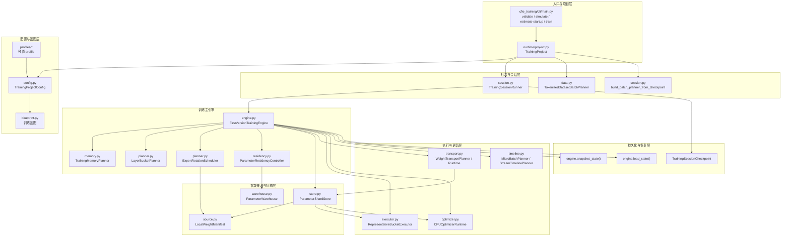
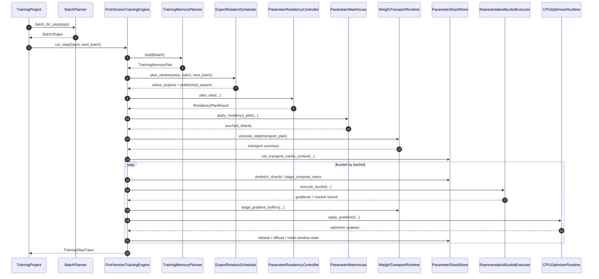

# 训练主线一：整体架构大图

## 1. 文档定位

本文面向 `CFIE/cfie_training/*` 这条训练主线一代码实现。
它不是路线判断文档，而是帮助读代码时先建立“整套训练系统是怎么拼起来的”。

适用范围：

- `cfie_training` 训练基座主链
- `35B` 开发基线与 `122B` 目标导向的统一训练 runtime
- bucket-local `backward -> update -> release`
- CPU / NVMe 参与的资源优先训练路径

本文重点替你回答 4 个问题：

1. 整个训练系统的总入口在哪里。
2. 每一步训练到底由哪些模块接力完成。
3. 参数、优化器状态、传输缓冲和 checkpoint 分别归谁管理。
4. 读代码时应该先看哪些文件，才能最快建立全局视角。

## 2. 一句话结论

训练主线一不是“把全模型一次性搬上 GPU 做传统训练”，而是一套资源优先的分层训练 runtime：

- `TrainingProject` 负责组装入口与会话；
- `FirstVersionTrainingEngine` 负责单步训练主闭环；
- `LayerBucketPlanner + ExpertRotationScheduler + TrainingMemoryPlanner` 负责“本步训练什么、按什么预算训练”；
- `ParameterResidencyController + ParameterWarehouse + ParameterShardStore + WeightTransportRuntime` 负责“参数现在在哪、要不要搬、搬完以后怎么存”；
- `RepresentativeBucketExecutor + CPUOptimizerRuntime` 负责“算梯度、做更新、立刻释放”；
- `TrainingSessionRunner + TrainingRuntimeSnapshot` 负责“多步会话、checkpoint、resume”。

## 3. 整体架构图

## 4. 核心分层

### 4.1 入口与项目层

- `cfie_training/cli/main.py`
  - 对外暴露 `validate`、`simulate`、`estimate-startup`、`train` 等训练基座命令。
- `cfie_training/runtime/project.py`
  - `TrainingProject` 是训练主线一最上层的编排对象。
  - 它负责创建 `TrainingProjectConfig`、构建引擎、选择 dataset-backed batch planner 或 checkpoint 恢复入口、启动训练会话。

如果你只想先知道“命令进来以后代码去哪了”，这里是第一站。

### 4.2 配置与蓝图层

- `cfie_training/config.py`
  - 定义整套训练系统的配置原语。
  - 这里不是只有一份扁平配置，而是按子系统拆成了：
    - `ModelSpecConfig`
    - `ExpertRotationConfig`
    - `BucketScheduleConfig`
    - `ExecutionConfig`
    - `OptimizerConfig`
    - `RuntimeQuantizationConfig`
    - `MemoryBudgetConfig`
    - `TrainingProjectConfig`
- `cfie_training/profiles/*`
  - 负责把某个具体模型画像落成 profile。
- `cfie_training/blueprint.py`
  - 把配置翻译成“训练蓝图”，用于解释系统应该如何运行，而不是执行运行时。

这层的意义是：先把“目标模型、预算、训练策略、量化策略、传输策略”描述清楚，后面的 runtime 才有统一输入。

### 4.3 批次与会话层

- `cfie_training/runtime/session.py`
  - `TrainingSessionRunner` 负责多步训练会话。
  - 同时负责 checkpoint 目录写出、resume 恢复与 planner checkpoint 续跑。
- `cfie_training/runtime/data.py`
  - `TokenizedDatasetBatchPlanner` 负责真实文本 / JSONL 数据集切 batch。
- `build_batch_planner_from_checkpoint(...)`
  - 只允许从 `tokenized_dataset` planner checkpoint 恢复 batch planner。

当前训练主线已经不再保留 `SyntheticBatchPlanner` 作为入口；主链只认 dataset-backed 批次与对应 checkpoint 恢复。

这层回答的是：

- “这一步训练喂什么 batch？”
- “多步训练如何连续跑？”
- “中断以后如何从 checkpoint 恢复？”

### 4.4 规划层

规划层是训练主线一最重要的“控制面”。

- `cfie_training/runtime/memory.py`
  - `TrainingMemoryPlanner` 把模型规模、batch 形状、预算和状态字节数，折算成 GPU / CPU / NVMe 三层预算。
- `cfie_training/runtime/planner.py`
  - `LayerBucketPlanner` 决定层如何切 bucket。
  - `ExpertRotationScheduler` 决定当前 step 的 active experts 和 prefetched experts。
- `cfie_training/runtime/residency.py`
  - `ParameterResidencyController` 把“这一步要激活哪些模块”转换成标准化迁移序列：
    - `nvme_cold -> cpu_staged -> gpu_active -> cpu_dirty -> nvme_cold`

可以把这层理解成：

- `LayerBucketPlanner` 决定“按什么粒度训练”
- `ExpertRotationScheduler` 决定“本步训练哪些 routed experts”
- `TrainingMemoryPlanner` 决定“预算容不容得下”
- `ParameterResidencyController` 决定“要怎么搬”

### 4.5 参数来源与状态层

这一层分成两个概念，不要混：

1. 参数从哪里来
2. 参数当前处于什么状态

对应模块分别是：

- `cfie_training/runtime/source.py`
  - `LocalWeightManifest` 负责把 shard 映射到本地 safetensors 权重文件。
  - 这里是训练 runtime 接真实模型权重的入口。
- `cfie_training/runtime/warehouse.py`
  - `ParameterWarehouse` 负责记录 shard 级别的“逻辑驻留状态”和版本。
  - 它更像状态账本。
- `cfie_training/runtime/store.py`
  - `ParameterShardStore` 负责真正持有 shard 对应的参数缓冲、量化视图、GPU 计算视图、NVMe mirror 等运行时实体。
  - 它更像物理存储层。

一句话区分：

- `Warehouse` 关心“这块参数现在应该在什么层、是第几个版本”
- `Store` 关心“这块参数现在具体有什么 buffer / tensor / quantized view”

## 5. 单步训练时序图

## 6. 单步真实闭环

引擎真实执行时，主闭环可以压缩成下面这条链：

`batch planner -> memory plan -> expert window plan -> residency plan -> warehouse touched_shards -> transport execute_step -> parameter_store cache context -> bucket stream -> executor forward/backward -> CPU optimizer update -> release/offload -> step trace`

其中 `engine.py` 里的责任分界非常关键：

- `plan_step(...)`
  - 更偏“规划视图”，用于看这一步会发生什么。
- `run_step(...)`
  - 真实执行闭环。
- `_run_bucket_stream(...)`
  - 真正把 bucket 逐个跑起来的核心热路径。
- `snapshot_state()` / `load_state()`
  - 负责运行时快照与恢复。

## 7. 关键对象应该怎么理解

### 7.1 `TrainingMemoryPlan`

这是全局预算书。

它告诉后续模块：

- bucket 总数
- 每 bucket 的 non-routed / active-routed 参数规模
- activation 常驻字节数
- host gradient buffer 范围
- 传输 staging buffer 规模
- GPU / CPU / NVMe 是否在预算内

### 7.2 `ExpertWindowPlan`

这是当前 step 的专家训练窗口。

它至少会给出：

- 当前 active experts
- 下一步 prefetched experts
- 当前决策是 round-robin 还是 router-hotness 派生

### 7.3 `ParameterShardSnapshot`

这是训练 runtime 里最重要的 shard 级公共语言。

它在不同子系统之间流转：

- `Warehouse` 产出 touched shards
- `Transport` 根据 shard 做传输规划
- `Store` 根据 shard 构建参数缓冲与量化视图
- `Executor` 和 `Optimizer` 都围绕 shard 工作

### 7.4 `TrainingRuntimeSnapshot`

这是 resume 的核心。

它会把下面这些状态冻结下来：

- step 序号
- static modules 是否已预热
- residency controller 状态
- warehouse shard 快照
- parameter store shard 快照
- transport 缓存和 buffer 池
- optimizer shard 快照
- 累计 sample / token 计数
- expert rotation window cache

## 8. 训练主线一真正的设计重点

如果只看整体实现，不要先陷进某个 kernel 或某个 optimizer 细节，先抓住这 5 个设计重点：

1. 训练的最小闭环不是“整模型一步更新”，而是“按 bucket 完成 backward -> CPU update -> release”。
2. routed experts 不是长期全量常驻，而是按 step 窗口轮换。
3. `Warehouse` 和 `Store` 是分开的，前者管逻辑状态，后者管实际参数实体。
4. CPU / NVMe 不是旁路，而是这条主线的正式参与层。
5. checkpoint / resume 保存的不是一个单独模型文件，而是整套训练运行时状态。

## 9. 推荐读码顺序

想最快掌握全局，建议按这个顺序读：

1. `cfie_training/runtime/project.py`
   - 先看项目层怎么把 CLI、engine、session 串起来。
2. `cfie_training/runtime/engine.py`
   - 重点看 `__post_init__`、`run_step()`、`_run_bucket_stream()`、`snapshot_state()`。
3. `cfie_training/runtime/planner.py`
   - 看 bucket 划分和 expert window 决策。
4. `cfie_training/runtime/residency.py`
   - 看驻留状态机。
5. `cfie_training/runtime/warehouse.py` + `cfie_training/runtime/store.py`
   - 看逻辑状态和物理存储如何分层。
6. `cfie_training/runtime/transport.py`
   - 看 staged file cache 与 weight / gradient buffer 池。
7. `cfie_training/runtime/executor.py`
   - 看代表性执行器如何生成 bucket 级梯度。
8. `cfie_training/runtime/optimizer.py`
   - 看 CPU 优化器状态与更新如何落地。
9. `cfie_training/runtime/session.py`
   - 最后看会话层如何组织多步训练与 checkpoint。

## 10. 相关文档

- `../../路线文档/01_训练主线一_训练基座.md`
- `./00_目录导航.md`
