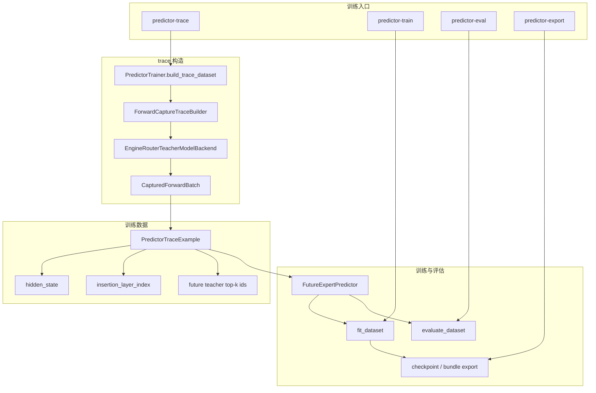

# 训练主线二：真实隐藏状态训练闭环

## 1. 文档定位

本图只描述当前 Predictor 训练侧已经真实落地的主链，不再把旧蓝图路径和兼容路径混为一谈。

## 2. 总体结构图

## 3. 当前主链说明

### 3.1 数据来源

当前主链优先走 tokenized dataset batch：

- 只要 `BatchShape.token_rows` 可用
- `PredictorTrainer` 就会优先选择 `ForwardCaptureTraceBuilder`

### 3.2 teacher 信号采集

`EngineRouterTeacherModelBackend` 会：

- 复用 CFIE `LLMEngine` 执行真实 teacher 前向
- 通过 `enable_predictor_capture` 打开目标层 hidden-state 捕获
- 通过 `take_predictor_hidden_states()` 回收各层真实 `hidden_state`
- 通过 `RequestOutput.outputs[0].routed_experts` 收集真实 teacher top-k experts

### 3.3 样本结构

当前每条训练样本最重要的字段是：

- `hidden_state`
- `token_index`
- `insertion_layer_index`
- `future_layer_indices`
- `future_teacher_topk_ids`

### 3.4 训练模型

当前训练模型已经是：

- `FutureExpertPredictor`

而不是早期“只吃 summary 向量”的旧模型口径。

## 4. 兼容路径位置

当前源码里仍保留的兼容痕迹，主要只剩：

- 旧 `hidden_summary` 兼容读取

其中 `hidden_summary` 只用于旧 trace 数据的兼容读取，不代表当前训练主链仍会生成或消费 summary 输入。

## 5. 当前收尾点

当前训练侧最重要的架构收尾点是：

- 删除或合并重复定义，避免“一份主线 + 一份旧实现”并存
- 让文档、代码、测试都只把真实 hidden state 路径当作主线
