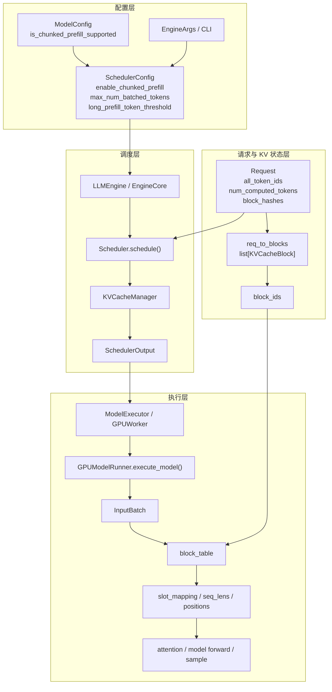
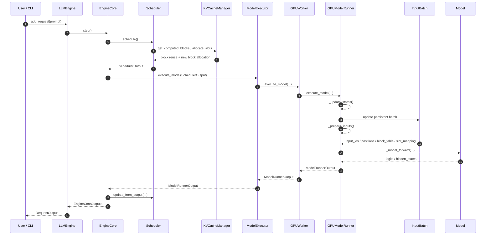

# 推理主线一：调度、Chunked Prefill 与 KV Cache 总览

## 1. 文档定位

本文整合并替代以下 3 份旧文档：

- `scheduler_code_walkthrough.md`
- `chunked_prefill_flow.md`
- `kv_cache_request_allocation.md`

它们原本都在解释同一条推理主线一架构，只是切分角度不同。整合后，这里统一回答：

1. `chunked_prefill` 是在哪里决定、在哪里真正切 chunk 的。
2. scheduler 输出给 worker 的到底是什么。
3. request、KV block、block ids、block table、slot mapping 之间是什么关系。
4. 从配置到 worker forward 的真实控制流是什么。

适用范围：

- `CFIE/cfie/v1/*` 原生 v1 推理链
- 客户端推理主链
- scheduler / chunked prefill / KV cache / worker 输入准备

## 2. 一句话结论

当前推理主线一不是“prefill 系统”和“decode 系统”两套独立链路，而是一条统一 scheduler 主链：

- 配置层先决定能不能启用 `chunked_prefill`
- `Scheduler.schedule()` 决定本轮到底切多少 token
- `KVCacheManager` 决定复用哪些旧 block、分配哪些新 block
- `SchedulerOutput` 把统一结果交给 worker
- worker 再把 `block_ids` 落成 `block_table` 和 `slot_mapping`，最后进入 attention / forward
- 对 Qwen3.5 MoE，专家内存卸载默认开启；若文档、命令或 profile 未显式关闭，都默认按“GPU 保留少量 expert slots、其余 routed experts 走 CPU / NVMe 分层驻留并按需回载”理解。
- 当前阶段的主线约束是：MoE 模型优先依赖 `tiered cache` 释放显存压力，`MoE offload` 就是当前原生默认方案，而不是把 `UVA` / 通用 CPU offload 当成主链默认前提。
- `UVA`、`prefetch` 与其他通用 CPU offload 路径，当前优先保留给非 MoE 模型推理的后续稳定化工作；在这些通路单独稳定之前，不反向要求当前 MoE 主线依赖它们。

## 3. 总体架构图

## 4. 端到端时序图

## 5. 先抓住 4 个核心事实

### 5.1 `chunked_prefill` 先在配置层决定“可不可以”

配置阶段最关键的入口是：

- `cfie/config/model.py`
- `cfie/engine/arg_utils.py`
- `cfie/config/scheduler.py`

这里主要做两件事：

1. 由 `ModelConfig.is_chunked_prefill_supported` 给出模型能力默认值。
2. 由 `EngineArgs` 把用户输入和模型能力折叠成最终的 `SchedulerConfig`。

所以配置层回答的是：

- 默认是否启用
- token budget 怎么定

但它还没有回答：

- 本轮实际切多大 chunk

### 5.2 真正切 chunk 的地方在 `Scheduler.schedule()`

真正把长 prompt 切成 chunk 的地方在 scheduler，而不是 worker。

也就是说：

- worker 不重新决定 chunk 大小
- worker 只是消费 scheduler 已经决定好的调度结果

这也是当前链路最容易误解的地方。

### 5.3 KV cache 有 4 层表示，不要混

同一个 request 的 KV，在系统里至少会经过 4 层表示：

| 层级 | 主要结构 | 作用 |
| --- | --- | --- |
| 请求逻辑层 | `Request.block_hashes` | prefix cache 查询键，不是物理 block |
| scheduler 对象层 | `req_to_blocks` | request 当前真正持有的 `KVCacheBlock` |
| 传输层 | `block_ids` | 把对象降成可序列化的物理编号 |
| worker 执行层 | `block_table` / `slot_mapping` | attention 真正消费的地址关系 |

### 5.4 `SchedulerOutput` 是统一调度结果，不存在单独的“prefill batch 对象”

当前设计不是：

- prefill 一套输出结构
- decode 一套输出结构

而是：

- scheduler 统一生成 `SchedulerOutput`
- prefill chunk 和 decode token 都在同一个 token budget 里竞争
- worker 按统一格式执行

## 6. Chunked Prefill 的真实控制点

可以把这条链压缩成下面这句：

`模型能力默认值 -> EngineArgs -> SchedulerConfig -> Scheduler.schedule() -> num_scheduled_tokens -> worker 消费调度结果`

真正需要盯住的字段是：

- `enable_chunked_prefill`
- `max_num_batched_tokens`
- `long_prefill_token_threshold`
- `request.num_computed_tokens`
- `request.num_tokens`
- `num_scheduled_tokens[req_id]`

理解方法很简单：

- `request.num_computed_tokens`
  - 表示“已经算到哪”
- `request.num_tokens`
  - 表示“理论上现在总共应覆盖到哪”
- 二者的差值
  - 就是 scheduler 还需要推进多少工作

如果 token budget 不够，而 `enable_chunked_prefill=True`，scheduler 会只取一部分 token 进入本轮。

## 7. KV Cache 的真实拥有关系

### 7.1 `Request` 不直接拥有 worker 最终使用的 `block_table`

`Request` 持有的是逻辑状态，例如：

- `all_token_ids`
- `num_computed_tokens`
- `block_hashes`

它不直接持有：

- 物理 block 对象
- worker 侧 `block_table`

### 7.2 `SingleTypeKVCacheManager.req_to_blocks` 才是 request 到物理 block 的真实映射

这个结构才回答：

- “这个 request 当前真正占有哪些 block”

所以排查 KV 问题时，不要只盯 `Request.block_hashes`，要盯：

- `req_to_blocks`

### 7.3 `BlockPool` 同时承担三种职责

`BlockPool` 不是单纯的空闲队列，它同时承担：

- 全部物理 block 对象池
- free block queue
- prefix cache 索引

因此 prefix cache 命中不是去 request 身上查，而是去 `BlockPool.cached_block_hash_to_block` 查。

### 7.4 worker 最终消费的不是 block 对象，而是 slot 关系

worker 这一侧最终关心的是：

- `block_ids`
- `block_table`
- `slot_mapping`

其中真正进入 attention kernel 的，是 `slot_mapping` 对应的实际 slot 关系。

## 8. 代码阅读入口

如果你要从代码层快速掌握这条架构，建议按这个顺序读：

1. `cfie/engine/arg_utils.py`
   - 看 `chunked_prefill` 默认值和 scheduler 参数怎么生成。
2. `cfie/config/scheduler.py`
   - 看 scheduler 真正持有哪些关键字段。
3. `cfie/v1/core/sched/scheduler.py`
   - 看 chunk 在哪里切、token budget 如何竞争。
4. `cfie/v1/request.py`
   - 看 request 级逻辑状态。
5. `cfie/v1/core/block_pool.py`
   - 看 block 池和 prefix cache 索引。
6. `cfie/v1/core/single_type_kv_cache_manager.py`
   - 看 request 和物理 block 的真实映射。
7. `cfie/v1/worker/gpu_model_runner.py`
   - 看 `SchedulerOutput` 如何落成 `InputBatch`、`block_table`、`slot_mapping`。

## 9. 相关文档

- `../../路线文档/03_推理主线一_客户端推理主链.md`
- `./00_目录导航.md`
