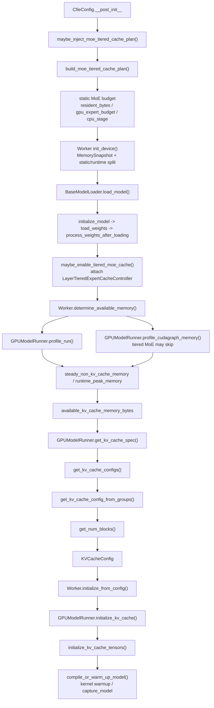

# 推理主线一：显存划分与 KV Cache 规划链路

## 1. 文档定位

本文专门解释推理主线一里“显存是怎么被分账的”。

它回答 4 个问题：

1. `MoE tiered cache plan` 是在什么时候算的。
2. 模型参数是什么时候真正加载到设备并开始占用预算的。
3. 启动期的真实显存峰值是在哪里测出来的。
4. `KV cache` 是在什么时候、根据什么结果最终划分成 `num_blocks` 并真正分配的。

这篇文档只讲启动期显存规划链，不展开请求执行期的 scheduler 细节；调度与 block table 链路请看：

- [01_调度与KV缓存总览.md](./01_调度与KV缓存总览.md)

## 2. 一句话结论

当前主线的真实顺序不是“先加载完再统一分显存”，而是：

`CfieConfig 静态 MoE 规划 -> worker 切 static/runtime 预算 -> 模型加载并挂 tiered cache controller -> profile 真实非 KV 峰值 -> 计算可给 KV 的预算 -> 生成 KVCacheConfig -> 真正分配 KV cache -> warmup / capture`

其中最容易混淆的一点是：

- `MoE plan` 里虽然会预估 `kv_bytes`，但那只是给专家驻留预算做静态先验，不是最终实际分配出来的 `KV cache`。
- 最终 `KV cache` 大小的决定权，仍然在 `determine_available_memory()` 和 `get_kv_cache_configs()` 这条链上。

## 3. 总体流程图

## 4. 分阶段拆解

### 4.1 配置期先做静态 MoE 规划

关键入口：

- `cfie/config/cfie.py`
- `CfieConfig.__post_init__`
- `cfie/offload/policy.py`
- `maybe_inject_moe_tiered_cache_plan()`
- `build_moe_tiered_cache_plan()`

这一层发生得很早，在 worker 真正加载模型之前。

它做的不是“实际分配显存”，而是基于模型结构、量化格式、`gpu_memory_utilization`、主机内存预算和推测的运行期预留，先得到一份启动期静态计划。对 Qwen3.5 MoE 而言，这份计划至少会回答：

- GPU 最多能常驻多少 routed expert slots。
- prefill burst pool 能不能开，以及能开多少。
- CPU static cache 预算和 CPU staging 预算大概是多少。
- 如果 CPU 还不够，是否继续向 NVMe spill。

在 planner 内部，最关键的中间量是：

- `kv_bytes`
- `linear_state_bytes`
- `dynamic_bytes`
- `resident_bytes`
- `raw_gpu_expert_budget_bytes`

其中：

- `resident_bytes = dense_bytes + kv_bytes + linear_state_bytes`
- `raw_gpu_expert_budget_bytes = gpu_budget_bytes - resident_bytes - dynamic_bytes - shared_gpu_reserve_bytes`

这一步的 `kv_bytes` 只是 MoE planner 的静态估算值，用来避免专家预算把整张卡挤满。

### 4.2 worker 启动时先切出 static budget 和 runtime headroom

关键入口：

- `cfie/v1/worker/gpu_worker.py`
- `Worker.init_device()`
- `cfie/v1/worker/utils.py`
- `get_static_memory_budget()`
- `cfie/utils/mem_utils.py`
- `split_gpu_memory_budget()`

worker 初始化设备后，会先拿一份 `MemorySnapshot`，然后按 `gpu_memory_utilization` 把总显存切成两块：

- `static_memory_budget`
- `runtime_memory_headroom`

可以把它理解成：

- `static_memory_budget`
  允许常驻的那一部分，后面要容纳模型权重、常驻非 KV 显存，以及最终能分给 KV 的部分。
- `runtime_memory_headroom`
  专门留给运行期峰值波动，不应该被静态常驻内容吃掉。

当前实现不是把 `gpu_memory_utilization` 当成“KV cache 占比”，而是把它当成“整份静态显存预算占比”。

### 4.3 模型加载完成后，MoE plan 才真正附着到层上

关键入口：

- `cfie/model_executor/model_loader/base_loader.py`
- `BaseModelLoader.load_model()`
- `initialize_model(...)`
- `load_weights(...)`
- `process_weights_after_loading(...)`
- `maybe_enable_tiered_moe_cache(...)`

模型加载链的顺序是：

`initialize_model -> load_weights -> process_weights_after_loading -> maybe_enable_tiered_moe_cache`

也就是说：

- MoE plan 在配置期就已经算出来了。
- 但只有走到 `maybe_enable_tiered_moe_cache()`，这份 plan 才会被读取并挂成每层的 `LayerTieredExpertCacheController`。

所以“静态 MoE 规划”与“真实模型层开始按 plan 管理专家显存”是两步，不是一步。

### 4.4 真实启动峰值 profiling 发生在模型加载之后

关键入口：

- `cfie/v1/engine/core.py`
- `EngineCore._initialize_kv_caches()`
- `cfie/v1/executor/abstract.py`
- `determine_available_memory()`
- `cfie/v1/worker/gpu_worker.py`
- `Worker.determine_available_memory()`
- `cfie/v1/worker/gpu_model_runner.py`
- `profile_run()`
- `profile_cudagraph_memory()`

`EngineCore` 在真正规划 KV cache 之前，会先向 executor 请求一次“每个 worker 还能拿出多少显存给 KV cache”。

这一步不是静态推理，而是真实跑一轮启动 profiling：

- `profile_run()`
  触发 dummy forward，测出权重加载后、执行期 activation 和非 torch 运行时缓冲的真实峰值。
- `profile_cudagraph_memory()`
  若后续需要抓 CUDA graph，则额外估算 graph pool 占用。

对当前 Qwen3.5 MoE + tiered cache 主线，要额外记住：

- tiered MoE expert remap 和 host-backed load 目前不是 capture-safe。
- 因此这条路径下 `profile_cudagraph_memory()` 可能直接跳过。
- 这时启动期显存收口主要依赖 `profile_run()` 的 eager 路径测量结果。

### 4.5 真正可分给 KV 的预算在这里才被定下来

关键入口：

- `cfie/v1/worker/gpu_worker.py`
- `Worker.determine_available_memory()`

这一步的核心结论不是“总共还有多少空闲显存”，而是：

- `steady_non_kv_cache_memory`
- `runtime_peak_memory`
- `available_kv_cache_memory_bytes`

其中当前主链最关键的是：

- `available_kv_cache_memory_bytes = static_memory_budget - steady_non_kv_cache_memory`

并且要同时满足：

- `runtime_peak_memory <= runtime_memory_headroom`

所以当前设计是明确分层的：

- 运行期峰值走 `runtime headroom`。
- 静态常驻部分走 `static budget`。
- `KV cache` 只能从已经扣掉 steady non-KV 的静态预算里拿空间。

### 4.6 KV cache 规划才在这之后发生

关键入口：

- `cfie/v1/worker/gpu_model_runner.py`
- `get_kv_cache_spec()`
- `cfie/v1/core/kv_cache_utils.py`
- `get_kv_cache_configs()`
- `get_kv_cache_config_from_groups()`
- `get_num_blocks()`
- `generate_scheduler_kv_cache_config()`

顺序是：

1. `get_kv_cache_spec()` 从 attention 层抽出每层需要的 `KVCacheSpec`。
2. `get_kv_cache_configs()` 结合每个 worker 的 `available_memory` 生成各自的 `KVCacheConfig`。
3. `get_kv_cache_config_from_groups()` 按 group/page size 计算 tensor 布局。
4. `get_num_blocks()` 最终把预算换算成 `num_blocks`。
5. 多 worker 时，再统一收敛到所有 worker 中最小的 `num_blocks`。
6. `generate_scheduler_kv_cache_config()` 把 worker 侧配置归并成 scheduler 视角配置。

因此，`num_blocks` 的最终来源不是 MoE planner，而是：

`available_kv_cache_memory_bytes -> page_size / num_layers -> get_num_blocks()`

### 4.7 真正的 KV 张量分配是最后一步

关键入口：

- `cfie/v1/worker/gpu_worker.py`
- `initialize_from_config()`
- `cfie/v1/worker/gpu_model_runner.py`
- `initialize_kv_cache()`
- `initialize_kv_cache_tensors()`

只有到这里，KV cache 才会真的在设备上分配张量、reshape 成每层视图，并绑定进 static forward context。

后续紧跟着的才是：

- `compile_or_warm_up_model()`
- `kernel_warmup(...)`
- `capture_model()`

也就是说：

- `KV cache` 一定是在 warmup/capture 之前建好的。
- 运行期编译、kernel 预热和 cudagraph 捕获，都是在既定 `KVCacheConfig` 之上做的。

## 5. 当前主线最重要的 5 个事实

1. `MoE tiered cache plan` 先于模型加载，是配置期静态规划，不是运行期 profiling 的结果。
2. `tiered cache controller` 的真实挂载发生在模型加载链末尾，而不是 `CfieConfig.__post_init__` 里。
3. 启动期真实峰值由 `determine_available_memory()` 驱动，核心测量入口是 `profile_run()`。
4. 最终 `KV cache` 大小来自 `available_kv_cache_memory_bytes`，不是 planner 里的 `kv_bytes`。
5. 对当前 Windows Qwen3.5 MoE 主线，tiered cache 路径下可能跳过 cudagraph profiling/capture，因此 eager 路径显存测量更重要。

## 6. 代码阅读顺序

如果你要从代码层快速掌握这条链，建议按下面顺序看：

1. `cfie/config/cfie.py`
   - 看 `CfieConfig.__post_init__` 何时注入 MoE plan。
2. `cfie/offload/policy.py`
   - 看 `build_moe_tiered_cache_plan()` 如何做静态预算分账。
3. `cfie/model_executor/model_loader/base_loader.py`
   - 看 plan 何时在模型加载链上落地。
4. `cfie/offload/weight_offload.py`
   - 看 `LayerTieredExpertCacheController` 如何被挂到 FusedMoE 层上。
5. `cfie/v1/worker/gpu_worker.py`
   - 看 `determine_available_memory()` 如何测真实峰值并算出 KV 可用预算。
6. `cfie/v1/worker/gpu_model_runner.py`
   - 看 `profile_run()`、`profile_cudagraph_memory()`、`initialize_kv_cache()`。
7. `cfie/v1/core/kv_cache_utils.py`
   - 看 `get_kv_cache_configs()`、`get_kv_cache_config_from_groups()`、`get_num_blocks()`。
8. `cfie/v1/engine/core.py`
   - 看整条启动链如何把 profiling、KV 规划和 warmup 串起来。

## 7. 相关文档

- [01_调度与KV缓存总览.md](./01_调度与KV缓存总览.md)
- [../../路线文档/03_推理主线一_客户端推理主链.md](../../路线文档/03_推理主线一_客户端推理主链.md)
## 8. 2026-04-12 本轮实现更新

### 8.1 显存预算口径更新

- `cfie/offload/policy.py::_get_gpu_budget_bytes()`
  现在按“当前可用显存”读取静态预算入口，再通过 `split_gpu_memory_budget(...)` 切出 `static_budget`。
- `cfie/offload/policy.py::_get_gpu_runtime_headroom_bytes()`
  现在同样按“当前可用显存”切出 ratio 外的 runtime headroom。
- 这样 `build_moe_tiered_cache_plan()` 与 worker 启动阶段的显存分账主线保持一致，避免 planner 用总显存、worker 用可用显存造成的预算漂移。

### 8.2 规划链与模型下载链同步

- `cfie/offload/policy.py::_resolve_model_path_for_moe_plan()`
  已接入 `cfie/loader/weight_utils.py::prepare_weights(...)`。
- 因此 planner 不再要求 `model_path` 必须一开始就是本地目录；repo id 也可以先解析到本地缓存目录，再继续读取 safetensors 元数据。

### 8.3 CPU 专家缓存主线更新

- `cfie/offload/policy.py::build_moe_tiered_cache_plan()`
  现在把 CPU 侧收敛为“全量专家静态镜像”。
- 规划结果上，`cpu_static_bytes = expert_bytes_total`，`cpu_slots_per_layer = num_experts`，`initial_cpu_experts = all experts`。
- 同时，`staging_bytes = 0`，`nvme_expert_bytes = 0`，表示当前主线不再依赖 NVMe spill 与 staging buffer。

### 8.4 运行时加载主线更新

- `cfie/offload/weight_offload.py::LayerTieredExpertCacheController._get_source_bundle()`
  现在只接受来自 CPU static mirror 的来源。如果请求的 expert 不在 `initial_cpu_experts` 覆盖范围内，会直接报错。
- `cfie/offload/weight_offload.py::LayerTieredExpertCacheController._init_cpu_fixed_pools()`
  不再预分配 staging bundle，只保留 CPU static experts 与 raw buffer。
- 运行时默认的数据搬运方向已经收敛为：
  `local safetensors -> CPU static mirror -> GPU resident slot`

### 8.5 当前代码阅读时最重要的新结论

1. `KV cache` 规划链没有改变，仍然是 `profile -> available_kv_cache_memory_bytes -> KVCacheConfig -> initialize_kv_cache()`。
2. 改变的是 MoE 专家预算口径：GPU 预算现在更保守，CPU 预算现在更集中，运行时数据来源现在更单纯。
3. 如果你在代码里看到 `staging_bytes`、`nvme_expert_bytes`、`_cpu_stage_bundle` 这些字段，请按“兼容旧字段”理解，而不要再把它们当成当前主线成立的核心依赖。

## 9. 2026-04-13 更新：MoE offload 的 runtime-ready CPU static mirror 设计

### 9.1 旧设计的问题

旧主线中，CPU static experts 主要保存 checkpoint 原始形态。这样在 expert miss 时，运行时还要重复执行：

- `gate/up/down -> w13/w2` 合并
- `gptq_marlin` 的 `repack`
- `scale permute`
- 再把结果写入 GPU resident slot

这意味着对 `122B` 这类大模型，如果一层恰好有 `8` 个 missing experts，
运行时会发生 `8` 轮逐 expert 的 CPU/GPU 交互与预处理开销。

### 9.2 新设计的正确方向

正确方向应是：

1. CPU static mirror 保存 runtime-ready 权重，而不是 checkpoint 原始格式。
2. `w13/w2` 合并与 `repack/permute` 在 expert 首次物化到 CPU static mirror 时完成一次。
3. 运行时 miss 路径只负责：
   - 从 CPU static mirror 取出 runtime-ready expert
   - 直接写入 GPU resident slot
4. 对 `N<=8` 个 missing experts，应有明确的 batch load 入口，最终收敛成 `_C` / C++/CUDA 算子。

### 9.3 当前代码状态

本轮代码已开始按这个方向收敛：

- `LayerTieredExpertCacheController._materialize_cpu_static_bundle(...)`
  现在在 CPU static bundle 完成 safetensors 读取后，会立刻进入 `_preprocess_cpu_static_bundle(...)`
- `gptq_marlin` 路径会生成带 `runtime.*` 前缀的 CPU bundle
- 非量化路径会生成 `runtime.w13_weight / runtime.w2_weight`
- `LayerTieredExpertCacheController.prepare(...)`
  现在先聚合本轮 miss experts，再进入 `_load_experts_into_slots(...)`
- `_write_expert_bundle(...)`
  遇到 `runtime_ready=True` 的 bundle 时，不再重复执行旧的预处理链

### 9.4 当前尚未完成的最后一步

目前 batch load 入口已经存在，但真正的“单次算子完成 8 experts 上载”还未下沉成 `_C` 算子。

也就是说：

- **已完成**：runtime-ready CPU static mirror 设计落地
- **已完成**：批量加载入口语义落地
- **未完成**：真正的 `_C` / C++/CUDA batch H2D 加载算子

后续应优先把这个算子补齐，再做 `122B` 的整链性能验证。

## 10. 2026-04-13 更新：runtime-ready batch load `_C` 链路已落地

### 10.1 当前显存装载链路

当某层出现一批 `miss experts` 时，当前主线已经收敛为：

1. `prepare(...)` 聚合本轮缺失 experts
2. `_load_experts_into_slots(...)` 统一生成 `(expert_id, slot)` 批次
3. `_get_source_bundle(...)` 命中 CPU static mirror
4. 若 bundle 已是 `runtime_ready=True`
   - `_write_expert_bundles(...)` 优先进入 `_C` 批量加载路径
5. `_C` op 内部完成：
   - batched CPU tensor -> target GPU device
   - `index_copy_(0, slot_ids, src_gpu_batch)` 覆盖 resident slots
6. `_install_mapping(...)` 刷新 expert -> slot 映射

### 10.2 当前两条 `_C` 批量加载入口

- 非量化：
  - `moe_batch_load_unquantized_runtime_precompiled(...)`
- GPTQ Marlin：
  - `moe_batch_load_gptq_runtime_precompiled(...)`

这两条路径都要求 CPU 侧输入已经是 runtime-ready 形态，因此 miss 热路径不再重复做：

- `gate/up/down -> w13/w2`
- `gptq_marlin_moe_repack(...)`
- `marlin_moe_permute_scales(...)`

### 10.3 现阶段设计收益

- 把“逐 expert、逐字段 copy”收敛为“单次批量 `_C` 调用”
- 保持 Linux / Windows 共用同一条 Python 调度入口
- 为后续把 `ATen + index_copy_` 再下沉成更专用 CUDA kernel 预留稳定接口
