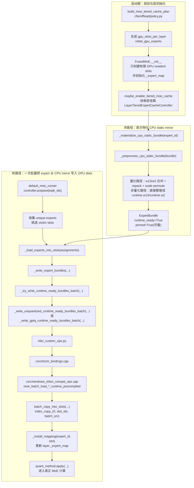

# 推理主线一：8-BaseSlot CPU→GPU 批量上载架构图

## 1. 文档定位

这份文档只回答一个问题：

> 昨天完成的 `8-base` 升级里，MoE 专家是如何从 CPU 内存一路进入 GPU resident slots 的？

这里的“`8-base`”不是指 `_C` 算子内部写死只能处理 8 个 expert，而是指当前主线里最常见的批量换入规模：

- 一方面，MTP 规划里有 `base_8` 语义，来自 `cfie/offload/policy.py:36`
- 另一方面，Qwen3.5 MoE 常见 `top_k=8`
- 因此运行时最常见的热路径就是：一次收集 8 个待换入 expert，然后成批从 CPU mirror 覆盖到 GPU slots

也就是说：

- **8 是当前主线常见批量规模**
- **不是 `_C` 批量上载 op 的硬编码上限**
- 真实批量大小由 `slot_ids.numel()` 决定

本文只覆盖这条主线：

`CPU static mirror(runtime-ready, pinned)` → `批量上载 op` → `GPU resident slots`

不展开：

- router 数学本身
- 最终 expert GEMM / fused MoE 计算细节
- 非 runtime-ready 的旧 fallback 细节

---

## 2. 一图总览



---

## 3. 先抓住三个核心结论

### 3.1 现在 CPU mirror 里放的不是 checkpoint 原始专家

当前主线已经改成：

- CPU static mirror 优先保存 **runtime-ready expert**
- 也就是提前完成过一次推理所需的格式整理
- 运行时 miss 时不再重新做：
  - `w1 + w3 -> w13`
  - `gptq_marlin_moe_repack(...)`
  - `marlin_moe_permute_scales(...)`

对应入口：

- `cfie/offload/weight_offload.py:610`
- `cfie/offload/weight_offload.py:665`
- `cfie/offload/weight_offload.py:677`
- `cfie/offload/weight_offload.py:773`

### 3.2 “8-base” 热路径里，不再是 8 个 expert 各自重新预处理

现在主线是：

1. 先从 CPU static mirror 取出已经 runtime-ready 的 bundle
2. 按字段把多个 expert 叠成 batched CPU tensor
3. 一次调用 `_C` 批量上载 op
4. 由 `_C` 把这些 batched tensor 覆盖到多个 GPU slot

所以它已经不再是：

`8 个 expert × 每个 expert 单独 assemble/repack/permute`

而是：

`1 批 runtime-ready experts → 1 次 Python op 调用 → 多个 batched field copy`

### 3.3 现在真正的“热路径主入口”在 `controller.prepare(topk_ids)`

前向中 routed expert 一旦不全在 resident slots，就会进入：

- `cfie/model_executor/layers/fused_moe/runner/default_moe_runner.py:256`

然后顺着下面这条链走：

- `controller.prepare(...)`
- `_load_experts_into_slots(...)`
- `_write_expert_bundles(...)`
- `_try_write_runtime_ready_bundles_batch(...)`
- `_write_gptq_runtime_ready_bundles_batch(...)` 或 `_write_unquantized_runtime_ready_bundles_batch(...)`

---

## 4. 关键入口索引

| 阶段 | 入口 | 位置 | 作用 |
| --- | --- | --- | --- |
| 规划 | `DEFAULT_MTP_BASE_GPU_SLOTS = 8` | `cfie/offload/policy.py:36` | 定义 MTP/base_8 的基础语义 |
| 规划 | `build_moe_tiered_cache_plan(...)` | `cfie/offload/policy.py:142` | 计算 `gpu_slots_per_layer`、`prefill_burst_slots`、`initial_gpu_experts` |
| 规划结果落盘 | `gpu_slots_per_layer=int(...)` | `cfie/offload/policy.py:448` | 把每层可创建的 GPU resident slots 数写入 plan |
| 层初始化 | `tiered_cache_plan = get_moe_tiered_cache_plan(...)` | `cfie/model_executor/layers/fused_moe/layer.py:456` | 读取 plan，决定当前层是否进入 tiered cache 语义 |
| 层初始化 | `self.local_num_experts = min(...)` | `cfie/model_executor/layers/fused_moe/layer.py:473` | 把 GPU 侧真实创建的 expert 数收缩成 resident slot 数 |
| 层初始化 | `self.register_buffer("_expert_map", expert_map)` | `cfie/model_executor/layers/fused_moe/layer.py:487` | 建立“全局 expert → 当前 GPU slot”的运行时映射表 |
| 挂载控制器 | `maybe_enable_tiered_moe_cache(...)` | `cfie/offload/weight_offload.py:1810` | 给每个启用层挂载 `LayerTieredExpertCacheController` |
| 冷路径物化 | `_materialize_cpu_static_bundle(...)` | `cfie/offload/weight_offload.py:610` | 首次把某个 expert 从 store 物化到 CPU static mirror |
| 预处理 | `_preprocess_quantized_static_bundle(...)` | `cfie/offload/weight_offload.py:677` | 量化路径把 checkpoint 权重变成 runtime-ready |
| 预处理 | `_preprocess_unquantized_static_bundle(...)` | `cfie/offload/weight_offload.py:773` | 非量化路径整理成 `runtime.w13_weight` / `runtime.w2_weight` |
| 前向桥接 | `controller.prepare(chunk_topk_ids)` | `cfie/model_executor/layers/fused_moe/runner/default_moe_runner.py:256` | 进入真正的 expert 换入热路径 |
| 热路径聚合 | `_load_experts_into_slots(...)` | `cfie/offload/weight_offload.py:817` | 把待换入 expert 收集成一批 |
| 热路径分流 | `_try_write_runtime_ready_bundles_batch(...)` | `cfie/offload/weight_offload.py:879` | 判断是否可走新主线的 runtime-ready 批量上载 |
| 非量化批量上载 | `_write_unquantized_runtime_ready_bundles_batch(...)` | `cfie/offload/weight_offload.py:957` | 组 `slot_ids`、`w13_batch`、`w2_batch`，调用 `_C` |
| GPTQ 批量上载 | `_write_gptq_runtime_ready_bundles_batch(...)` | `cfie/offload/weight_offload.py:980` | 组 batched qweight/scales/qzeros/g_idx，调用 `_C` |
| Python 包装层 | `moe_batch_load_*_runtime_precompiled(...)` | `cfie/_custom_ops.py:808` | 统一 Python → `torch.ops._C` 调用入口 |
| Torch 注册 | `ops.def/ops.impl` | `csrc/torch_bindings.cpp:493` | 注册这两个 `_C` op 的 schema 和实现 |
| C++ 实现 | `moe_batch_load_unquantized_runtime_precompiled(...)` | `csrc/windows_triton_compat_ops.cpp:2691` | 非量化批量写槽位 |
| C++ 实现 | `moe_batch_load_gptq_runtime_precompiled(...)` | `csrc/windows_triton_compat_ops.cpp:2699` | GPTQ 批量写槽位 |
| 底层 helper | `batch_copy_into_slots(...)` | `csrc/windows_triton_compat_ops.cpp:303` | 用 `index_copy_` 把 batched expert 写到目标 slot 维 |

---

## 5. 8-base 热路径的完整时序

## 5.1 启动期：先把“最多允许多少 GPU slot”定下来

这一步发生在 planner 阶段：

- `build_moe_tiered_cache_plan(...)` 根据模型大小、显存预算、KV cache 预算，算出：
  - `gpu_slots_per_layer`
  - `prefill_burst_slots`
  - `cpu_slots_per_layer`
  - `initial_gpu_experts`
- 如果是 MTP/base_8 语义，则会以 `8` 作为 resident slot 的基础下限之一

对应位置：

- `cfie/offload/policy.py:142`
- `cfie/offload/policy.py:448`
- `cfie/offload/policy.py:452`
- `cfie/offload/policy.py:519`

## 5.2 层初始化：FusedMoE 只创建有限个 GPU resident slots

`FusedMoE` 在初始化时不会再为所有 expert 全量建 GPU 参数，而是：

- 从 plan 取出 `gpu_slots_per_layer`
- 把 `self.local_num_experts` 缩成 slot 数
- 构造 `_expert_map`
  - resident 的 expert 映射到 `[0, 1, 2, ...]`
  - 不 resident 的 expert 标成 `-1`

对应位置：

- `cfie/model_executor/layers/fused_moe/layer.py:456`
- `cfie/model_executor/layers/fused_moe/layer.py:473`
- `cfie/model_executor/layers/fused_moe/layer.py:478`
- `cfie/model_executor/layers/fused_moe/layer.py:487`

这一步是“8-base 能成立”的前提，因为 GPU 侧首先必须存在有限个可复用的 resident slot 容器。

## 5.3 冷路径：某个 expert 第一次进入 CPU mirror 时，先做成 runtime-ready

真正的关键更新在这里：

- `controller._materialize_cpu_static_bundle(expert_id)` 会：
  1. 从 safetensors expert store 拿到这个 expert
  2. 交给 `_preprocess_cpu_static_bundle(...)`
  3. 变成 runtime-ready 的 CPU bundle
  4. 尽量放进 pinned memory

### GPTQ 路径下，runtime-ready 包含什么

在 `cfie/offload/weight_offload.py:677`：

- 先把 checkpoint 里的 `gate/up/down` 还原成单 expert 视角
- 然后在设备侧做一次：
  - `gptq_marlin_moe_repack(...)`
  - `marlin_moe_permute_scales(...)`
- 再把结果回落到 CPU，保存为：
  - `runtime.w13_qweight`
  - `runtime.w2_qweight`
  - `runtime.w13_scales`
  - `runtime.w2_scales`
  - `runtime.w13_qzeros`
  - `runtime.w2_qzeros`
  - 可选 `runtime.w13_g_idx` / `runtime.w2_g_idx`
  - 可选 `runtime.w13_g_idx_sort_indices` / `runtime.w2_g_idx_sort_indices`

### 非量化路径下，runtime-ready 包含什么

在 `cfie/offload/weight_offload.py:773`：

- 直接整理成：
  - `runtime.w13_weight`
  - `runtime.w2_weight`

### `ExpertBundle` 的语义

`cfie/offload/cpu_backend.py:16` 里：

- `tensors`：这一个 expert 的全部字段
- `nbytes`：容量统计
- `pinned`：是否已转为 pinned CPU memory
- `runtime_ready`：是否已经是运行时可直接消费的格式

这就是为什么现在主线强调：

- CPU mirror 存的是 **“可直接上显存的 runtime-ready 专家”**
- 不是 **“还要临时再加工的原始 checkpoint 专家”**

## 5.4 前向热路径：先看本轮请求缺谁

前向里 routed expert 真正切入点在：

- `cfie/model_executor/layers/fused_moe/runner/default_moe_runner.py:256`

逻辑是：

1. 对当前 chunk 的 `topk_ids` 求 unique expert 集合
2. 如果 resident slots 足够，就直接 `controller.prepare(chunk_topk_ids)`
3. `prepare(...)` 内部：
   - 算出本轮请求的 unique experts
   - 跳过已经 resident 的 expert
   - 为缺失 expert 选择 victim slot
   - 形成 `assignments = [(expert_id, slot), ...]`
4. 然后进入 `_load_experts_into_slots(assignments)`

对应位置：

- `cfie/offload/weight_offload.py:817`

## 5.5 热路径批量上载：真正的“8-base”发生在这里

`_load_experts_into_slots(...)` 做三件事：

1. 根据 `expert_id` 取出已经 runtime-ready 的 CPU bundle
2. 把本轮所有待加载 expert 收集成 `bundles_and_sources`
3. 调 `_write_expert_bundles(...)`

然后 `_write_expert_bundles(...)` 优先走：

- `_try_write_runtime_ready_bundles_batch(...)`

对应位置：

- `cfie/offload/weight_offload.py:866`
- `cfie/offload/weight_offload.py:879`

### 非量化批量上载

在 `cfie/offload/weight_offload.py:957`：

- 先创建：
  - `slot_ids`
  - `w13_batch`
  - `w2_batch`
- 然后一次调用：
  - `ops.moe_batch_load_unquantized_runtime_precompiled(...)`

### GPTQ 批量上载

在 `cfie/offload/weight_offload.py:980`：

- 先创建：
  - `slot_ids`
  - batched `w13_qweight`
  - batched `w2_qweight`
  - batched `w13_scales`
  - batched `w2_scales`
  - batched `w13_qzeros`
  - batched `w2_qzeros`
  - 可选 batched `g_idx` / `sort_indices`
- 然后一次调用：
  - `ops.moe_batch_load_gptq_runtime_precompiled(...)`

### 这里为什么说“不是 8 次 CPU↔GPU 预处理”

因为此时已经不再逐 expert 做：

- assemble
- repack
- scale permute

而是直接用已经整理好的 CPU runtime-ready bundle 成批上载。

更准确地说：

- **不是 8 个 expert × 各自完整预处理**
- 而是 **1 批 expert × 若干个 batched 字段 copy**

当前实现上：

- 非量化路径：主要是 `w13`、`w2` 两个 batched field
- GPTQ 路径：是 `qweight/scales/qzeros/(可选 g_idx)` 这些 batched field

所以它已经把热路径成本从“按 expert 重复做格式转换”降成了“按字段做 batched 覆盖”。

## 5.6 Python → `_C` → `index_copy_`

Python 包装入口在：

- `cfie/_custom_ops.py:808`

Torch 注册在：

- `csrc/torch_bindings.cpp:493`

Windows 当前 `_C` 实现里：

- `moe_batch_load_unquantized_runtime_precompiled(...)`
- `moe_batch_load_gptq_runtime_precompiled(...)`

最终都落到：

- `batch_copy_into_slots(...)`

对应位置：

- `csrc/windows_triton_compat_ops.cpp:303`
- `csrc/windows_triton_compat_ops.cpp:2691`
- `csrc/windows_triton_compat_ops.cpp:2699`

`batch_copy_into_slots(...)` 当前核心逻辑很直接：

1. 检查 `src` 与 `dst` 除 batch 维外形状一致
2. 把 `slot_ids` 和 `src` 移到目标设备
3. 执行：

```text
dst.index_copy_(0, slot_ids_device, src_device)
```

也就是说，这个“8-base 算子”的本质是：

- 把第 0 维视为 slot 维
- 用 `slot_ids` 指定本轮要覆盖哪些 resident slots
- 把 batched CPU runtime-ready experts 覆盖到对应 GPU slot 上

## 5.7 上载完成后，立即更新映射表

完成批量写入后，控制器会调用：

- `cfie/offload/weight_offload.py:1775`

也就是 `_install_mapping(expert_id, slot)`，把：

- `global expert id -> current GPU resident slot`

重新写回 `layer._expert_map`。

这样后续：

- routed kernel
- quant method
- 后续 chunk

看到的就是新的 resident 布局。

---

## 6. 不要混淆的两个缓冲区层次

## 6.1 单 expert CPU raw buffer

入口：

- `cfie/offload/weight_offload.py:1663`
- `cfie/offload/weight_offload.py:1742`

这两个分别是：

- `_allocate_quantized_raw_buffer(...)`
- `_allocate_unquantized_raw_buffer(...)`

它们的定位是：

- 单 expert 级别的 CPU staging / raw buffer
- 用于冷路径预处理或旧 fallback
- 不是新的主线批量上载缓冲区

所以不要把它理解成：

> 每次 8 个 expert 激活，就一定要把这两个 buffer 循环用 8 次再逐个上载

当前主线已经不是这样。

## 6.2 runtime-ready CPU static mirror

真正服务“8-base”热路径的是：

- `ExpertBundle(runtime_ready=True, pinned=True)` 组成的 CPU static mirror

热路径里批量上载用的是这些 bundle 中的：

- `runtime.*` 字段

而不是原始 checkpoint 字段。

---

## 7. 你调试时最值得下断点的地方

如果你想最快看懂昨天那次升级，推荐按这个顺序下断点：

1. `cfie/model_executor/layers/fused_moe/runner/default_moe_runner.py:256`
   - 看当前 chunk 请求了哪些 `topk_ids`
2. `cfie/offload/weight_offload.py:817`
   - 看 `assignments` 里本轮要把哪些 expert 写进哪些 slot
3. `cfie/offload/weight_offload.py:879`
   - 看这批 bundle 是否都满足 `runtime_ready=True`
4. `cfie/offload/weight_offload.py:980`
   - 看 GPTQ 路径最终组出的 batched field 形状
5. `cfie/_custom_ops.py:832`
   - 看 Python 是否真的进入 `_C` op
6. `csrc/windows_triton_compat_ops.cpp:2699`
   - 看 C++ 是否正确收到 `slot_ids` 和各字段 batched tensor
7. `csrc/windows_triton_compat_ops.cpp:303`
   - 看最终 `index_copy_` 的 source / destination 是否匹配
8. `cfie/offload/weight_offload.py:1775`
   - 看 `_expert_map` 是否被正确更新

调试时重点观察这几个变量：

- `slot_ids`
- `bundles_and_sources`
- `bundle.runtime_ready`
- `bundle.pinned`
- `layer._expert_map`
- `target.w13_* / target.w2_*` 的第 0 维大小

---

## 8. 当前这条主线的准确边界

### 已完成

- CPU static mirror 已优先保存 runtime-ready expert
- 热路径已优先走批量上载，而不是逐 expert 旧路径
- Windows `_C` 已有：
  - `moe_batch_load_unquantized_runtime_precompiled(...)`
  - `moe_batch_load_gptq_runtime_precompiled(...)`
- Python 高层主线没有为 Windows 单独另起业务分支

### 仍需注意

- 当前 `_C` 仍然是“按字段 batched 覆盖”，不是把 GPTQ 全字段完全揉成单个底层 DMA 描述
- 如果 bundle 不是 `runtime_ready`，仍会回退到旧路径
- `desc_act=True` 会引入额外的 `g_idx` 与 `sort_indices` 字段

---

## 9. 一句话总结

昨天完成的 `8-base` 升级，本质上是把 MoE expert miss 热路径从：

`逐 expert 重新组装 + 重新预处理 + 再逐个写 GPU`

改成了：

`CPU 侧长期保存 runtime-ready/pinned expert bundle → 运行时把一批 expert 直接覆盖到 GPU resident slots`

所以你查代码时，最应该盯住的不是旧的 raw buffer，而是这条链：

`default_moe_runner.py:256` → `weight_offload.py:817` → `weight_offload.py:879` → `weight_offload.py:980` → `cfie/_custom_ops.py:832` → `torch_bindings.cpp:501` → `windows_triton_compat_ops.cpp:2699`
