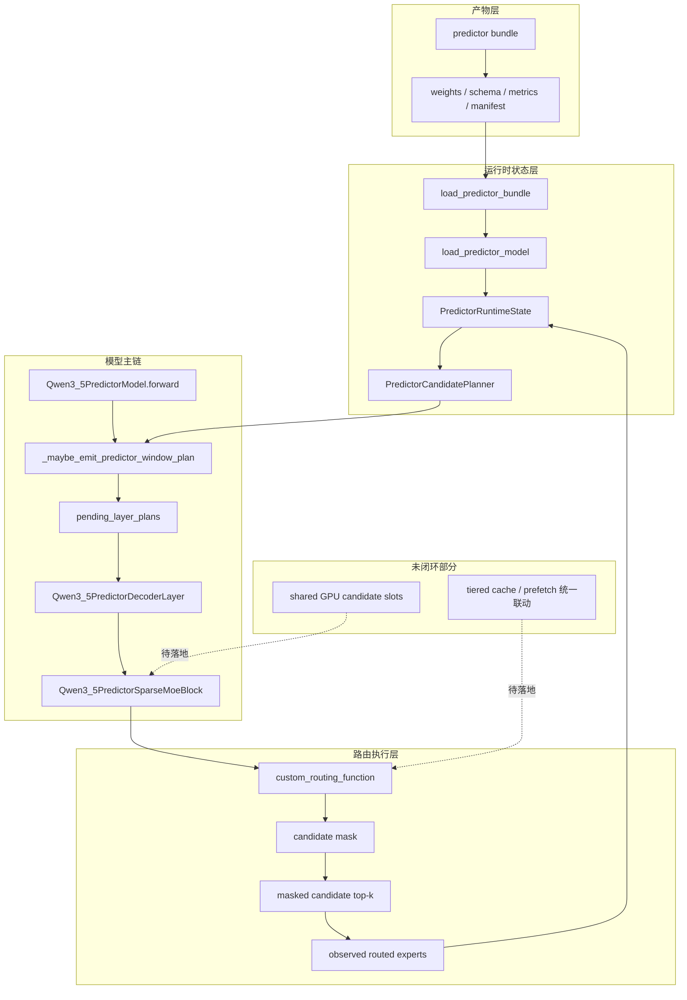

# 推理主线二：Predictor 隔离接入架构图

## 1. 文档定位

本图只描述当前已经真实进入推理执行链的 Predictor 接入结构，并显式标出尚未闭环的部分。

## 2. 一句话结论

当前 Predictor 推理侧已经不再只是“读取 bundle + 做 helper”，而是：

- 真正能在 forward 中发射 future window plan
- 真正能把 candidate plan 送进 MoE block
- 真正能执行 masked candidate routing

但 shared GPU candidate slots 仍未形成完整资源闭环。

## 3. 当前真实接入图

## 4. 分层说明

### 4.1 产物层

训练侧导出的 bundle 已经能够稳定被推理侧读取与校验。

### 4.2 运行时状态层

`PredictorRuntimeState` 当前已经承载：

- bundle/schema
- planner
- online expert state
- observed routing tracker

### 4.3 模型主链

`Qwen3_5PredictorModel` 当前会：

- 在指定 stride 层位上发射 predictor plan
- 维护 `pending_layer_plans`
- 把未来层 candidate plan 绑定到实际 decoder layer / MoE block

### 4.4 路由执行层

`Qwen3_5PredictorSparseMoeBlock` 当前会：

- 接管 custom routing
- 取 active layer plan 的 `candidate_expert_ids`
- 对非 candidate experts 做 mask
- 在允许 mismatch 时回退默认 top-k

因此这层已经不是“预留位”，而是实际执行逻辑。

## 5. 当前未闭环项

### 5.1 shared GPU candidate slots

当前仍缺：

- 统一槽位分配
- 与显存预算的真实绑定
- 与 tiered cache 资源管理的一致性

### 5.2 大模型验收

当前仍缺：

- 35B smoke 运行结果
- 122B 回归结果

## 6. 建议与路线文档配合阅读

- `../../路线文档/04_推理主线二_Predictor隔离接入.md`
- `../../路线文档/05_Predictor工程化落地追踪.md`
