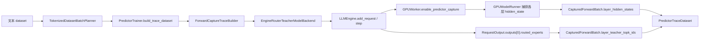

# 训练主线二：Predictor 路由 MoE

> 最后更新：2026-04-20  
> 当前训练主链输入：真实前向 `hidden_state`  
> 当前训练主链标签：`future_teacher_topk_ids`

## 1. 文档定位

本文只描述当前仍然有效的 Predictor 训练工程主链。

这里明确排除以下旧口径：

- 不再把 blueprint / 草稿设计当作当前实现；
- 不再把 synthetic trace / synthetic dataset fallback 当作主链；
- 不再把单独 `AutoModelForCausalLM.from_pretrained(...)` 的 teacher 直载方案当作主链；
- 不再把 “hidden summary 近似 hidden state” 当作训练输入。

当前唯一有效的训练口径是：

- 真实文本数据集；
- 真实推理引擎前向；
- 真实层内 `hidden_state`；
- 真实未来层 routed expert top-k 标签。

## 2. 当前要解决的问题

Predictor 训练侧现在要解决的是三件事：

1. 用真实 token 前向中的当前层 `hidden_state` 作为 predictor 输入；
2. 用真实未来层的 routed expert top-k 作为监督标签；
3. 在不污染普通推理链路的前提下，复用现有 CFIE 推理引擎完成 teacher capture。

## 3. 当前真实主链

### 3.1 输入

当前单条训练样本的输入由两部分组成：

- 当前插入层的真实 `hidden_state`
- 当前插入层号 `insertion_layer_index`

这里不再额外构造 `hidden_summary`。
训练时直接使用真实层输出，避免“摘要向量再反推层表示”的不稳定路径。

### 3.2 标签

当前单条训练样本的标签是未来窗口层的真实 teacher top-k expert id：

- `future_layer_indices`
- `future_teacher_topk_ids`

这里不再把 “router logits 全量张量” 作为主监督数据格式。
当前训练主链直接消费真实 top-k id。

### 3.3 批次来源

当前训练主链只接受 dataset-backed batch planner：

- `predictor-trace` 必须传 `--dataset`
- `predictor-train` 必须传 `--trace-input` 或 `--dataset`
- `predictor-eval` 必须传 `--trace-input` 或 `--dataset`

也就是说，Predictor 训练侧现在只认真实文本数据，不再走 synthetic fallback。

## 4. Teacher 采集链路

当前 teacher 采集链路已经切换为“复用推理引擎”：

这条链路的关键约束是：

- teacher 必须复用 CFIE 推理引擎；
- teacher 模型路径必须优先使用训练配置中的量化快照路径；
- 不允许 GPTQ 路径静默回退到 base snapshot；
- hidden-state capture 默认关闭，只在 predictor teacher 引擎里显式打开。

## 5. 当前关键代码入口

- `cfie_training/predictor/trainer.py`
  - `EngineRouterTeacherModelBackend`
  - `ForwardCaptureTraceBuilder`
  - `FutureExpertPredictor`
  - `PredictorTrainer`
- `cfie/v1/worker/gpu_model_runner.py`
  - `enable_predictor_capture()`
  - `disable_predictor_capture()`
  - `take_predictor_hidden_states()`
- `cfie/v1/worker/gpu_worker.py`
  - predictor capture 对应 RPC 入口

## 6. 训练与推理隔离边界

当前实现明确要求“训练不能污染普通推理”。

隔离方式如下：

- `GPUModelRunner.predictor_capture_enabled` 默认是 `False`
- 只有训练侧 teacher backend 才会通过 `collective_rpc("enable_predictor_capture")` 打开捕获
- `disable_predictor_capture()` 会恢复：
  - `predictor_capture_enabled = False`
  - `predictor_capture_layer_ids = ()`
  - `use_aux_hidden_state_outputs = False`
  - 模型侧 aux hidden-state layer 配置清空

因此，普通 `chat` / `generate` 链路默认不应受到 predictor 训练代码影响。

## 7. 三个 CLI 的工程顺序

当前 Predictor 训练流程建议按下面顺序执行：

1. `predictor-trace`
   - 作用：从真实 dataset + 真实 teacher 前向采集训练样本
2. `predictor-train`
   - 作用：训练 predictor，并输出 checkpoint
3. `predictor-eval`
   - 作用：在 trace 数据上验证 loss 与 recall

## 8. 当前验收口径

当前 Predictor 训练侧的正确验收口径是：

- 单测通过；
- teacher trace 明确复用引擎；
- 量化模型路径不再回退；
- 训练与普通推理隔离开；
- 35B / 122B 的真实训练 smoke 与普通推理回归，以 `05_Predictor工程化落地追踪.md` 作为动态总账。

按当前代码与总账文档，已经可以稳定确认：

- Predictor 相关单测已完成当前主线回归；
- `35B` 真实 predictor 训练 smoke 已完成；
- `122B` 真实 predictor 训练 smoke 已完成；
- 普通推理回归已完成，训练侧 capture 默认关闭，未污染普通推理配置；
- 当前剩余未完全收口的训练侧事项，主要是 `tests/unit/test_cfie_training_cli.py` 全量执行仍会在现环境超时。
